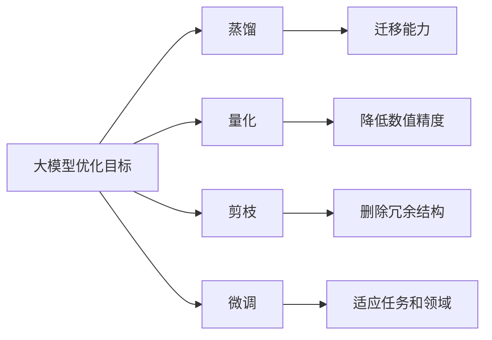
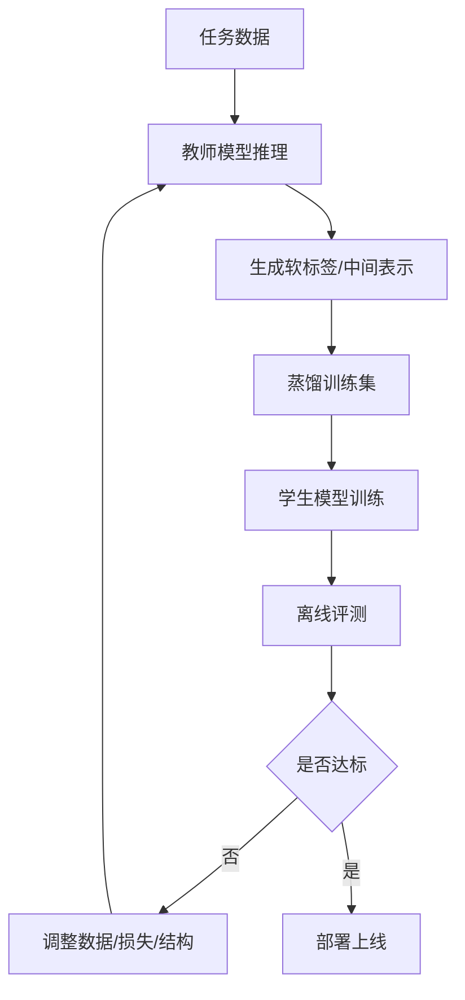
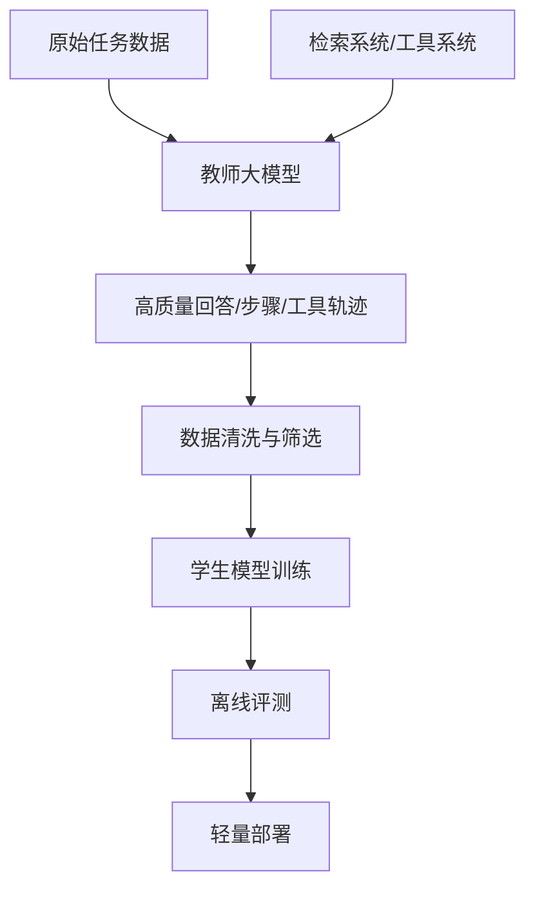
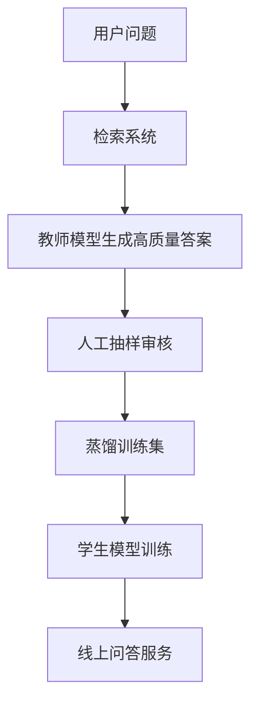

## 一、大纲

### 1. 蒸馏是什么
- 大模型语境里“蒸馏”的标准定义
- 广义“知识蒸馏”和狭义“模型蒸馏”的区别
- 为什么蒸馏不是简单压缩，而是知识迁移
- 如何用一句话理解蒸馏的本质

### 2. 为什么需要蒸馏
- 大模型为什么强但难以直接大规模部署
- 蒸馏在成本、延迟、设备适配和稳定性上的价值
- 为什么不是所有场景都该直接上最大模型
- 蒸馏在企业落地中的现实意义

### 3. 蒸馏与相关概念的区别
- 蒸馏与微调的区别
- 蒸馏与量化的区别
- 蒸馏与剪枝的区别
- 蒸馏与模型压缩、模型迁移的关系
- 什么时候优先考虑蒸馏，什么时候不该蒸馏

### 4. 蒸馏的核心角色与基本术语
- 教师模型与学生模型
- 硬标签与软标签
- Logits、概率分布与温度系数
- 中间层表示、注意力、隐藏状态
- 为什么软标签比硬标签信息更多

### 5. 蒸馏的基本流程
- 数据准备
- 教师推理与打标
- 构建蒸馏目标
- 训练学生模型
- 评估、迭代与上线
- 一个最常见的蒸馏训练闭环是什么样

### 6. 常见蒸馏方法
- Logit Distillation
- Feature Distillation
- Attention Distillation
- Sequence-Level Distillation
- Self-Distillation
- Offline、Online、Born-Again Distillation

### 7. 蒸馏中的关键设计点
- 温度系数怎么理解
- 蒸馏损失怎么组合
- 学生模型结构怎么选
- 训练数据怎么选
- 为什么高质量样本往往比样本量更关键

### 8. 大模型场景下的蒸馏方式
- 指令蒸馏
- 思维链蒸馏
- 响应蒸馏
- 偏好蒸馏
- 工具使用与 Agent 能力蒸馏
- RAG 场景中的蒸馏思路

### 9. 蒸馏的典型应用场景
- 端侧与边缘部署
- 企业私有化部署
- 垂直领域小模型构建
- 推理加速与成本优化
- 教师模型能力下放

### 10. 实战案例
- 文本分类蒸馏案例
- 企业问答助手蒸馏案例
- 蒸馏训练数据如何构造
- 如何判断蒸馏是否真的成功

### 11. 风险、局限与评估
- 能力丢失与错误继承
- 数据偏差与教师偏差放大
- 蒸馏后的模型为什么可能更快但更脆弱
- 如何设计评测集与线上观测

### 12. 术语表与学习路径
- 高频术语解释
- 常见误区
- 从基础概念走向工程实践的路径

---

## 二、蒸馏是什么

### 1. 标准定义

在人工智能和机器学习领域，蒸馏通常指的是：

**让一个较小的学生模型，去学习一个较大教师模型的行为、分布或中间表示，从而在更低成本下尽量保留教师模型的能力。**

这个定义里最重要的不是“把模型变小”，而是“把能力迁移过去”。

所以蒸馏的核心，不是压缩文件大小，而是下面这件事。

- 教师模型已经学到了一些有价值的模式。
- 学生模型不一定能直接从原始标签学到这么多模式。
- 通过模仿教师，学生可以更高效地逼近这些模式。

### 2. 一句话理解蒸馏的本质

一句话理解就是：

**蒸馏 = 用大模型教小模型做事。**

但这句话还可以再准确一点。

**蒸馏 = 让小模型学习大模型“怎么判断”和“怎么输出”，而不只是学习最终答案。**

### 3. 为什么叫“蒸馏”

这个词来自化学里的蒸馏过程。

原始物质中有很多成分，蒸馏的目标是提取其中更有价值、更精华的部分。

对应到模型里，可以这样理解。

- 教师模型很大，包含很多参数和复杂能力。
- 学生模型更小，容量有限。
- 蒸馏不是把教师完整复制一份，而是尽量提炼出关键知识和判断模式。

### 4. 狭义蒸馏与广义蒸馏

在工程实践里，“蒸馏”这个词有时会被说得更宽。

狭义上，它通常指标准的 Knowledge Distillation，也就是教师模型到学生模型的能力迁移。

广义上，有些团队也会把下面这些动作称为“蒸馏”。

- 把专家经验整理成规则。
- 把复杂流程整理成模板。
- 把历史案例提炼成知识库。
- 用大模型生成训练样本，供小模型或流程使用。

这类说法也有道理，但如果是在机器学习和大模型技术讨论中，默认还是以“教师-学生蒸馏”为主。

### 5. 一个最直观的例子

假设你有一个 70B 的教师模型和一个 7B 的学生模型。

用户问：

“请总结这份产品方案，保留目标、风险和行动项。”

如果直接训练 7B 模型，它可能只能学到“总结”这件事。

但如果 70B 教师模型已经能稳定产出结构清晰、重点分明的答案，那么你可以让 7B 模型去模仿。

它学到的就不只是“结果长什么样”，还包括。

- 哪些内容应该保留。
- 哪些信息优先级更高。
- 结构应该如何组织。
- 什么表达更符合任务要求。

这就是蒸馏的直觉。

---

## 三、为什么需要蒸馏

### 1. 大模型强，但并不总适合直接部署

大模型通常具备更强的泛化能力、更好的指令跟随能力、更丰富的表达和推理能力。

但在真实业务里，直接使用最大模型往往会遇到很多问题。

- 推理成本高。
- 响应延迟大。
- 显存占用高。
- 并发能力不足。
- 私有化部署门槛高。
- 某些场景下能力过剩但价格太高。

也就是说，大模型很强，但“强”不等于“最适合上线”。

### 2. 蒸馏解决的是“能力与成本之间的矛盾”

蒸馏的核心价值，就是在教师模型和业务部署之间搭一座桥。

企业真正想要的，通常不是“最强模型”，而是“在可接受成本下足够强的模型”。

蒸馏正是为这个目标服务的。

### 3. 蒸馏能带来哪些实际收益

最常见的收益包括。

- 降低推理成本。
- 降低部署门槛。
- 提升吞吐量。
- 缩短响应时间。
- 让特定任务能力更集中。
- 让模型更适合边缘设备或私有化环境。

### 4. 一个现实类比

可以把教师模型看成资深专家，把学生模型看成经过专项培训的新员工。

资深专家当然更全面，但也更贵、更难大规模复制。

如果把专家在某些高频任务上的经验系统化，再训练一批更轻量的员工去执行，就能在规模化场景里更高效。

这就是蒸馏在工程上的价值。

### 5. 并不是所有场景都要蒸馏

如果你的业务特点是下面这些情况，蒸馏的收益可能并不明显。

- 任务变化非常大，通用能力需求强。
- 业务量很小，调用成本不敏感。
- 对最高质量要求极高，不能接受明显能力下降。
- 教师模型本身还不稳定，尚未形成可靠行为。

蒸馏适合的是：

**某类任务已经比较清晰、调用量较大、对成本和速度敏感、而教师模型又确实表现更好。**

---

## 四、蒸馏与微调、量化、剪枝的区别

### 1. 蒸馏与微调

微调的重点，是让模型更适应某类任务或领域数据。

蒸馏的重点，是让学生模型去学习教师模型的行为模式。

当然，二者经常一起出现。

例如你可以先用教师模型生成高质量数据，再对学生模型微调，这其实也是一种蒸馏思路。

### 2. 蒸馏与量化

量化通常是把参数从高精度表示改成低精度表示，例如 FP16 变成 INT8 或 INT4。

它主要解决的是。

- 显存占用。
- 推理速度。
- 部署适配。

量化通常不改变模型的“知识来源”，只是改变模型的数值表示方式。

蒸馏则是在能力层面做迁移。

### 3. 蒸馏与剪枝

剪枝主要是删掉不重要的参数、通道或结构。

它更像“减枝”，目标是减少冗余。

蒸馏更像“教学”，目标是迁移判断模式。

### 4. 关系图



### 5. 对比表

| 方法 | 核心目标 | 是否改变知识来源 | 是否常用于加速 | 主要风险 |
| --- | --- | --- | --- | --- |
| 蒸馏 | 迁移教师能力 | 是 | 可以 | 能力丢失、教师偏差继承 |
| 微调 | 适应任务数据 | 是 | 不一定 | 过拟合、遗忘原能力 |
| 量化 | 降低存储与算力成本 | 否 | 是 | 精度下降 |
| 剪枝 | 删除冗余结构 | 否 | 是 | 结构破坏、稳定性下降 |

### 6. 什么时候优先用哪种方法

如果问题是“模型太大，推不动”，优先想到的是量化和剪枝。

如果问题是“想把大模型某类能力迁移到小模型”，优先想到的是蒸馏。

如果问题是“模型不懂本领域”，优先想到的是微调、RAG 或数据增强。

在实际项目中，最常见的组合往往是：

- 先蒸馏。
- 再微调。
- 最后量化部署。

---

## 五、蒸馏的核心角色与基本术语

### 1. 教师模型与学生模型

教师模型通常更大、更强、更贵。

学生模型通常更小、更快、更便宜。

蒸馏的目标，不是让学生完全复制教师，而是让学生在自己的容量约束下尽量学到教师的有效能力。

### 2. 硬标签与软标签

硬标签就是传统监督学习里的标准答案。

例如三分类任务中，标签可能只是。

- A 类：1
- B 类：0
- C 类：0

这说明正确答案是 A，但没有告诉你 B 和 C 哪个更接近 A。

软标签则不同。

教师模型可能输出。

- A 类：0.62
- B 类：0.28
- C 类：0.10

这就告诉学生模型：

- A 是最可能的。
- B 也有一定相似性。
- C 更不像。

这类信息就是蒸馏中非常有价值的“暗知识”。

### 3. 为什么软标签信息更多

硬标签只告诉你“对或错”。

软标签还能告诉你“像不像”“接近程度如何”“老师犹豫在哪”。

这种额外结构信息，经常能帮助学生模型学到更平滑、更接近教师的决策边界。

### 4. Logits 是什么

Logits 可以理解为模型在经过 softmax 之前的原始分数。

很多蒸馏方法不是直接让学生学最终类别，而是让学生去拟合教师的 logits 或概率分布。

### 5. 温度系数是什么

温度系数通常记作 T。

它的作用，是把教师输出的概率分布“拉平”一些。

直觉上可以这样理解。

- T 较低时，分布更尖锐，几乎只强调最优答案。
- T 较高时，分布更平滑，能更明显保留次优候选的信息。

这有助于学生模型学习类别之间的相对关系。

### 6. 一个简单例子

假设教师原本输出：

- 猫：0.95
- 虎：0.04
- 狗：0.01

如果温度提高后，可能变成：

- 猫：0.62
- 虎：0.28
- 狗：0.10

第二种分布更能体现“猫”和“虎”更相近，而“狗”差得更远。

这就是温度在蒸馏里的意义。

---

## 六、蒸馏的基本流程

### 1. 总体流程

标准蒸馏流程，通常可以概括成下面几步。

- 准备任务数据。
- 用教师模型对数据做推理。
- 收集教师输出或中间表示。
- 设计蒸馏目标与损失函数。
- 训练学生模型。
- 评估学生模型并迭代。

### 2. 流程图



### 3. 数据准备阶段

数据不一定非要是人工标注数据。

在大模型蒸馏里，常见数据来源包括。

- 原始任务数据。
- 公开指令数据。
- 企业内部样本。
- 教师模型生成的合成样本。
- 人工审核后的高价值样本。

### 4. 教师推理阶段

这一步通常要做的是。

- 给教师模型输入样本。
- 收集输出文本、logits、概率或中间层表示。
- 必要时让教师输出解释、步骤或结构化结果。

### 5. 训练学生阶段

这一步不是简单把教师答案当标签。

通常会组合多种目标。

- 学最终答案。
- 学概率分布。
- 学中间表征。
- 学注意力模式。

### 6. 评估与迭代阶段

蒸馏不是一次就能成功的。

评估后常见的迭代方向包括。

- 重新筛选数据。
- 调整温度。
- 调整损失权重。
- 更换学生结构。
- 增加边界样本。

---

## 七、常见蒸馏方法

### 1. Logit Distillation

这是最经典的蒸馏方式。

核心思想是让学生模型去匹配教师模型的输出分布。

也就是不要只学“标准答案是什么”，还要学“老师对其他候选项怎么看”。

优点是方法简单、通用性强。

缺点是只关注输出层，可能无法充分迁移更深层表示能力。

### 2. Feature Distillation

这种方法让学生模型去拟合教师模型中间层的隐藏表示。

可以理解为不只学老师的最终结论，还要学老师在中间是如何组织信息的。

它常用于视觉模型、编码器模型，也可扩展到 LLM 的隐藏状态对齐。

### 3. Attention Distillation

这种方法关注注意力矩阵。

也就是让学生去学习教师“看哪里、关注哪里”的模式。

对于 Transformer 架构来说，这是一种比较自然的蒸馏方式。

### 4. Sequence-Level Distillation

在生成任务里，蒸馏对象不只是单个类别，而是整个序列。

例如让学生去学习教师生成的摘要、回答、翻译结果。

这在 NLP 和大模型场景里很常见。

### 5. Self-Distillation

自蒸馏指的是教师和学生不一定是两个完全不同的模型。

有时是同一模型不同阶段、不同层，或者同一模型的多个检查点互相蒸馏。

### 6. Offline Distillation

离线蒸馏最常见。

先固定教师模型，提前生成蒸馏数据，然后训练学生。

优点是实现简单、成本可控。

### 7. Online Distillation

在线蒸馏是在训练过程中，教师和学生同时参与更新或交互。

这种方式更复杂，但在某些场景下更灵活。

### 8. Born-Again Distillation

这类方法会让结构相同或相近的模型反复蒸馏，类似“重新成长一遍”。

重点不在更小，而在让后续模型吸收前一代模型的行为模式。

### 9. 方法对比表

| 方法 | 蒸馏对象 | 适合场景 | 主要特点 |
| --- | --- | --- | --- |
| Logit Distillation | 输出分布 | 分类、通用任务 | 简单直接 |
| Feature Distillation | 中间层表示 | 表征学习、编码器任务 | 能传更多结构信息 |
| Attention Distillation | 注意力模式 | Transformer 模型 | 对齐关注重点 |
| Sequence-Level Distillation | 整段输出 | 翻译、摘要、问答 | 更贴近生成任务 |
| Self-Distillation | 自身行为 | 稳定训练、增益优化 | 不一定需要更大教师 |

---

## 八、蒸馏中的关键设计点

### 1. 温度不是越高越好

温度系数能让分布更平滑，但并不是越高越好。

太低，学生学不到丰富的相对关系。

太高，分布又会过于平，区分度不足。

所以温度本质上是一个平衡参数。

### 2. 损失函数通常是组合式的

实际蒸馏里，经常不是只用一种损失。

常见组合是。

```text
总损失 = alpha * 真实标签损失
	   + beta  * 教师软标签损失
	   + gamma * 中间层对齐损失
```

这表示学生既要对真实答案负责，也要尽量模仿教师。

### 3. 学生模型不是越小越好

学生模型太小，会出现一个现实问题。

教师会的东西很多，但学生容量不够，根本装不下。

这时蒸馏效果会明显受限。

所以学生结构选择的关键，不是“最小化”，而是“在部署约束内尽量保留足够容量”。

### 4. 数据质量比盲目扩量更重要

蒸馏时，很多人会本能地追求更多样本。

但在很多任务里，高质量样本往往比海量低质量样本更重要。

尤其是下面这些样本非常关键。

- 边界样本。
- 容易混淆的样本。
- 高价值业务样本。
- 教师与学生差距明显的样本。

### 5. 教师模型不一定越大越好

教师模型的价值，不只在于参数更多，还在于它在目标任务上是否真的更可靠。

如果教师本身输出不稳定、经常幻觉，那么蒸馏出来的学生也会被带偏。

### 6. 中间目标是否可解释

很多高质量蒸馏项目，不只是收集最终答案。

还会收集。

- 推理步骤。
- 证据片段。
- 风险判断理由。
- 结构化字段。

这样学生学到的通常不只是“像样输出”，而是更完整的任务模式。

---

## 九、大模型场景下的蒸馏方式

### 1. 为什么 LLM 蒸馏和传统分类蒸馏不完全一样

传统蒸馏很多发生在分类任务里，输出空间相对固定。

但大模型的任务更复杂。

- 输出是长文本。
- 任务是开放式的。
- 可能包含多轮对话。
- 可能依赖工具和检索。
- 可能要求推理过程。

所以 LLM 蒸馏通常不只是学 logits，还会学整段行为。

### 2. 指令蒸馏

指令蒸馏通常指让教师模型根据大量指令数据生成高质量回答，再用这些“指令-回答”对去训练学生模型。

它的目标是让学生具备更好的指令跟随能力。

### 3. 思维链蒸馏

如果教师模型在复杂任务上能给出更好的推理过程，那么可以让学生去学习这些过程。

但这里要注意一个现实问题。

学生不一定需要逐字模仿完整思维链，很多时候更有价值的是学习。

- 关键中间步骤。
- 结构化推理框架。
- 结论和依据之间的对应关系。

### 4. 响应蒸馏

响应蒸馏更关注最终输出的风格、结构和质量。

例如。

- 摘要要简洁。
- 回答要分点。
- 代码修复要附说明。
- 问答要带引用。

### 5. 偏好蒸馏

有些蒸馏会把“更受人类偏好”的结果也纳入目标。

例如教师不仅输出答案，还输出一组候选及偏好排序。

这样学生可以学到什么样的回答更有帮助、更安全、更符合业务要求。

### 6. 工具使用蒸馏

在 Agent 或工具调用场景里，蒸馏对象可能不只是文本结果，还包括。

- 什么时候调用工具。
- 调哪个工具。
- 参数如何构造。
- 何时终止。

这类蒸馏很有价值，因为它能把一个昂贵的 Agent 系统中的部分能力下放到更轻量模型。

### 7. RAG 场景下的蒸馏

在 RAG 系统中，也可以做蒸馏。

例如让教师模型结合检索结果生成高质量答案，再训练学生学习。

进一步还可以蒸馏。

- 查询改写能力。
- 文档重排序能力。
- 回答生成模板。

### 8. LLM 蒸馏架构图



---

## 十、蒸馏的典型应用场景

### 1. 端侧与边缘部署

例如手机、本地设备、工业终端、车载设备等场景。

这些环境对算力和延迟非常敏感，无法直接部署过大的模型。

蒸馏可以帮助把关键能力迁移到更小模型上。

### 2. 企业私有化部署

很多企业希望模型在内网运行。

但内网硬件资源通常没有公有云那么充足。

这时蒸馏可以帮助构建。

- 更适合内网运行的学生模型。
- 更聚焦具体任务的专用模型。

### 3. 垂直领域小模型构建

例如法务、医疗、金融、制造、安全等领域。

这些场景常常不是追求最通用，而是追求“在特定任务上足够强”。

蒸馏就很适合把教师模型的领域行为下放到小模型。

### 4. 成本敏感的高并发业务

例如客服问答、内容审核、工单分类、文档处理等场景。

调用量很大时，哪怕单次成本只降一点，总体收益也可能很明显。

### 5. 教师模型能力下放

有些组织会把最强模型留在离线链路中做。

- 数据标注。
- 复杂审核。
- 高价值样本生成。

然后把结果蒸馏给线上学生模型。

这样可以形成一种“离线强教师，线上轻学生”的架构。

---

## 十一、实战一：文本分类蒸馏案例

### 1. 场景定义

假设你要做一个工单分类系统，需要把工单分为下面几类。

- 产品问题。
- 使用咨询。
- 账单问题。
- 故障投诉。

你有一个效果不错但推理较慢的教师模型，以及一个适合线上部署的小模型。

### 2. 最简单的蒸馏思路

步骤可以这样设计。

1. 收集历史工单文本。
2. 用教师模型对每条工单给出类别分布。
3. 将真实标签和教师软标签一起用于训练学生模型。
4. 在边界样本上重点评测。

### 3. 为什么这比只学真实标签更有效

因为很多工单并不是绝对清晰的。

例如一条工单可能同时带有“账单争议”和“产品故障”的表述。

真实标签只会告诉学生最终归到哪类。

教师分布则会告诉学生另一类也很接近。

这种信息通常能让学生学到更自然的边界。

### 4. 一个简化伪代码

```python
for sample in training_data:
	teacher_probs = teacher(sample.text)
	student_probs = student(sample.text)

	hard_loss = cross_entropy(student_probs, sample.label)
	soft_loss = kl_div(student_probs, teacher_probs)
	loss = 0.5 * hard_loss + 0.5 * soft_loss

	loss.backward()
	optimizer.step()
```

### 5. 这个案例的关键点

- 教师必须比学生显著更强。
- 真实标签仍然重要，不能完全丢掉。
- 重点要看混淆类之间是否改善。
- 不要只看总体准确率，也要看召回率和边界样本表现。

---

## 十二、实战二：企业问答助手蒸馏案例

### 1. 场景定义

假设你有一个企业知识问答系统。

目前最强的教师模型可以做到。

- 回答相对准确。
- 表达清晰。
- 能引用依据。
- 能在证据不足时谨慎拒答。

但它太贵，不适合高并发线上使用。

### 2. 一个可行的蒸馏目标

你可以蒸馏的不只是最终答案，还可以包括。

- 问题改写结果。
- 检索后筛出的关键证据。
- 最终回答模板。
- 引用格式。
- 拒答条件。

### 3. 数据构造方式

可以按下面方式构造训练样本。

- 输入：用户问题 + 检索片段。
- 教师输出：回答 + 引用 + 置信度/是否拒答。
- 人工复核：抽样检查高价值或高风险样本。

### 4. 一个流程图



### 5. 这个案例为什么有价值

因为企业问答的价值不只在“回答”，还在下面这些能力。

- 遇到没把握的问题能否拒答。
- 是否会编造制度内容。
- 是否能引用正确依据。

如果这些行为能被蒸馏下来，学生模型就不只是更快，而是更接近业务需要。

### 6. 一个重要提醒

如果教师模型本身就经常幻觉，那么这种蒸馏反而会把问题复制到学生模型里。

因此，教师输出必须做质量控制。

---

## 十三、蒸馏的风险、局限与评估

### 1. 能力丢失

这是蒸馏最常见的问题。

学生模型容量更小，天然就不可能完整保留教师全部能力。

所以蒸馏的现实目标通常不是“完全复制”，而是“保住最重要的能力”。

### 2. 错误继承

教师模型如果存在系统性偏差、幻觉、风格问题，学生模型很可能会学过去。

所以蒸馏并不是天然让模型更好，它只是把教师行为迁移过去。

### 3. 任务外泛化变弱

蒸馏后的小模型常常在目标任务上表现不错，但在目标任务之外的开放场景上可能明显变弱。

这意味着蒸馏通常会带来某种“专长化”和“范围收缩”。

### 4. 数据偏差放大

如果蒸馏数据集中某类样本过多、某类边界情况不足，那么学生模型会形成偏科。

### 5. 评估不能只看平均分

蒸馏项目里，最容易出错的一点就是只看平均指标。

更应该关注下面这些维度。

- 核心任务成功率。
- 边界样本表现。
- 拒答和安全行为。
- 推理速度与成本。
- 与教师模型的差距。

### 6. 常见评估维度

| 维度 | 说明 |
| --- | --- |
| 任务效果 | 准确率、F1、ROUGE、人工评分、任务完成率 |
| 蒸馏保真度 | 学生与教师的一致性 |
| 速度成本 | 延迟、吞吐、显存、单次调用成本 |
| 稳定性 | 不同输入表达下的波动 |
| 安全性 | 幻觉率、越权率、拒答准确率 |

### 7. 线上观测非常重要

真正上线后，必须持续观察。

- 哪些问题开始答偏。
- 哪些问题回答变短但信息丢失。
- 哪些边界样本错误增加。
- 哪些拒答该拒不拒，或不该拒却拒了。

没有线上回流，蒸馏项目很容易停留在“离线看起来不错”。

---

## 十四、术语表

### 1. Knowledge Distillation

知识蒸馏，通常指教师模型向学生模型迁移能力的过程。

### 2. Teacher Model

教师模型，一般更大、更强，用于提供软标签、输出样本或中间表示。

### 3. Student Model

学生模型，一般更小、更快，用于承接教师能力并部署到目标环境。

### 4. Soft Label

软标签，不只是最终类别，而是教师输出的概率分布或 richer target。

### 5. Hard Label

硬标签，传统监督学习中的标准答案。

### 6. Temperature

温度系数，用来调整输出分布的平滑程度。

### 7. Logits

模型在 softmax 前的原始分数。

### 8. Sequence Distillation

序列级蒸馏，适合翻译、摘要、问答等生成任务。

### 9. Self-Distillation

自蒸馏，模型从自身不同阶段、不同层或不同版本学习。

### 10. Offline Distillation

离线蒸馏，先固定教师生成蒸馏数据，再单独训练学生。

---

## 十五、常见误区

### 1. 误区一：蒸馏就是把模型压缩一下

不准确。

蒸馏确实常用于压缩，但它的核心不是“压缩体积”，而是“迁移能力”。

### 2. 误区二：教师越大，蒸馏一定越好

也不一定。

如果教师在目标任务上不稳定，或者输出质量不高，再大的教师也可能把问题传给学生。

### 3. 误区三：蒸馏之后学生就能完全等于教师

通常不现实。

学生模型容量更小，往往只能保住最关键的一部分能力。

### 4. 误区四：只要教师生成更多数据就行

数据量重要，但数据质量和覆盖面更关键。

错误样本、偏样本、重复样本过多，都会影响蒸馏效果。

### 5. 误区五：蒸馏可以替代一切优化手段

不能。

很多系统仍然需要结合。

- 微调。
- RAG。
- 量化。
- 工程缓存。
- 路由策略。

蒸馏只是其中一种很重要的方法。

---

## 十六、总结与进阶学习路径

### 1. 一句话总结

大模型中的蒸馏，本质上是把强教师模型在特定任务上的有效能力迁移到更轻量的学生模型中，以换取更低的部署成本和更好的推理效率。

### 2. 重新抓住四个关键词

理解蒸馏，最重要的是抓住这四个词。

- 教师。
- 学生。
- 软标签。
- 迁移。

只要把这四个词想清楚，蒸馏的大部分概念就不会混乱。

### 3. 推荐学习顺序

建议按下面顺序学习和实践。

1. 先理解监督学习中的标签、概率分布和 softmax。
2. 再理解教师-学生蒸馏、软标签和温度系数。
3. 再学习特征蒸馏、序列蒸馏和自蒸馏。
4. 再进入大模型场景下的指令蒸馏、思维链蒸馏和工具使用蒸馏。
5. 最后结合微调、RAG、量化和部署来做完整工程实践。

### 4. 最后记住一个判断标准

当你考虑要不要做蒸馏时，可以问自己下面四个问题。

- 是否已经有一个明显更强的教师模型。
- 目标任务是否足够明确、足够高频。
- 部署环境是否真的需要更小更快的模型。
- 是否有能力做数据筛选、评测和持续迭代。

如果这四个问题大多回答“是”，那么蒸馏通常值得认真考虑。
