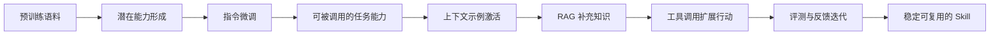
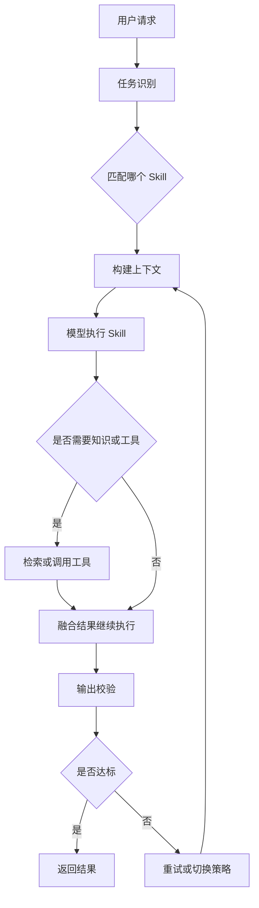
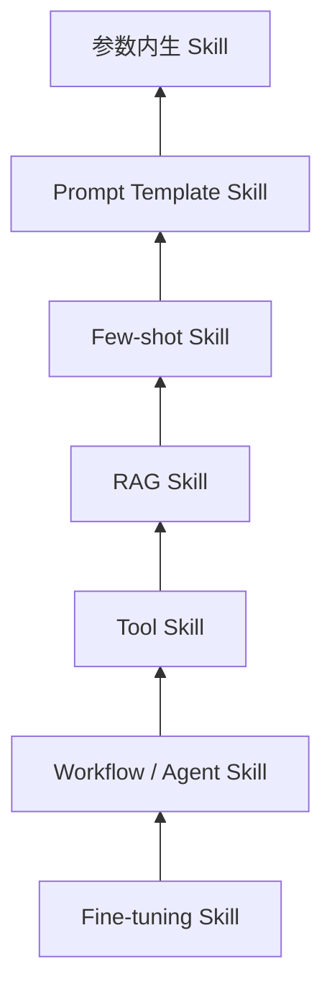
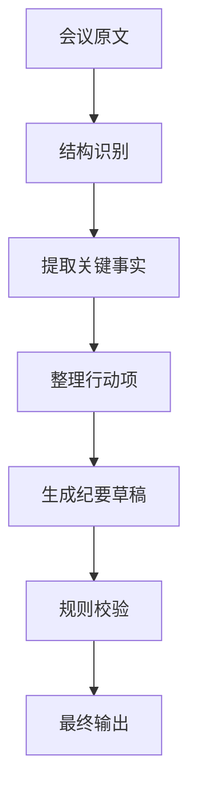
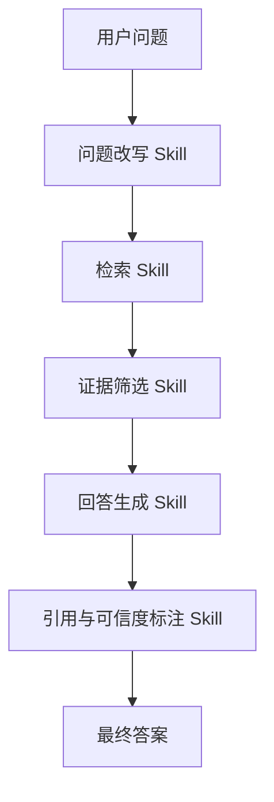

# 大模型中的 Skill

## 一、大纲

### 1. Skill 是什么
- 大模型语境里 Skill 的定义
- Skill 与能力、知识、任务、工具之间的关系
- 为什么 Skill 不是一个玄学词，而是一个工程概念
- 如何用一句话理解 Skill 的本质

### 2. 为什么要用 Skill 视角理解大模型
- 为什么“模型会不会”比“模型知不知道”更关键
- 从 Token 生成视角到任务能力视角的转变
- Skill 视角对产品设计、提示工程和 Agent 设计的意义
- 为什么 Skill 是连接模型能力与业务落地的重要桥梁

### 3. Skill 与相关概念的区别
- Skill 与 Knowledge 的区别
- Skill 与 Capability 的区别
- Skill 与 Prompt 的区别
- Skill 与 Tool 的区别
- Skill 与 Workflow、Agent 的区别

### 4. Skill 是如何形成的
- 预训练带来的潜在技能
- 指令微调带来的任务对齐
- 上下文学习激活技能
- 检索增强与工具调用扩展技能边界
- 反馈学习和评测迭代强化技能稳定性

### 5. Skill 的核心组成
- 任务目标
- 触发条件
- 输入模式
- 推理与执行策略
- 知识与工具依赖
- 输出格式与验收标准
- 安全边界与失败处理

### 6. Skill 的工作机制
- 任务识别
- Skill 路由
- 上下文构建
- 执行与校验
- 结果输出与反馈闭环
- Skill 为什么本质上是一种“可复用任务能力单元”

### 7. Skill 的常见分类
- 语言生成类 Skill
- 理解与抽取类 Skill
- 推理与规划类 Skill
- 工具使用类 Skill
- 领域专长类 Skill
- 元技能与自我校验类 Skill

### 8. Skill 的封装与实现方式
- 参数内生 Skill
- Prompt 模板 Skill
- Few-shot Skill
- RAG Skill
- Tool Skill
- Workflow / Agent Skill
- Fine-tuning Skill

### 9. Skill 的组合、路由与编排
- 单 Skill 与多 Skill 协作
- Router 模式
- Pipeline 模式
- Planner 模式
- Skill 组合为什么既强大又脆弱

### 10. 典型应用场景
- 文档总结与信息抽取
- 企业知识问答
- 数据分析与报表生成
- 代码生成、代码审查与修复
- 客服、运营与流程自动化

### 11. 实战案例
- 构建一个会议纪要总结 Skill
- 构建一个知识库问答 Skill
- 如何从单 Skill 升级到 Skill 组合
- 如何判断一个 Skill 已经足够稳定可复用

### 12. 风险、局限与评估
- Skill 幻觉、迁移失败与上下文脆弱性
- 工具依赖和外部环境不确定性
- Skill 评估指标与测试集设计
- 线上观测、版本管理与持续优化

### 13. 常见误区与学习路径
- 不是写了 Prompt 就等于有 Skill
- 不是知识越多 Skill 就越强
- 不是步骤越长 Skill 就越稳定
- 从 Prompt 到 RAG 到 Agent 的合理学习顺序

---

## 二、Skill 是什么

### 1. 大模型中的 Skill 定义

在大模型语境里，Skill 通常指模型在某一类任务上表现出的、可被触发、可被复用、可被评估的能力单元。

这个定义里有几个关键词非常重要。

- 第一，可被触发。
- 第二，可被复用。
- 第三，可被评估。
- 第四，面向任务。

也就是说，Skill 不是泛泛而谈的“模型很强”，而是更具体地说：

- 它能不能稳定地总结一篇长文。
- 它能不能从合同里抽取关键字段。
- 它能不能把自然语言转成 SQL。
- 它能不能在给定工具后完成多步任务。

如果一个模型只是“看起来懂很多”，但在特定任务上不稳定、不可控、不可复用，那么从工程角度看，这种能力还不能算成熟 Skill。

### 2. 一句话理解 Skill 的本质

一句话理解就是：

**Skill = 大模型在特定任务上的稳定可调用能力。**

这里的“能力”，不是单纯知识储备。

这里的“稳定”，不是偶然答对一次。

这里的“可调用”，意味着它能在需要时被激活、被组合、被检验。

### 3. 为什么 Skill 不是一个玄学词

很多人第一次接触这个概念时，会觉得 Skill 很抽象，像是一个营销词。

其实不是。

Skill 背后对应的是一个很务实的工程问题：

**我们如何把模型的泛化能力，转成业务上可用的任务能力。**

例如对于一个企业助手系统，业务方不关心模型参数量多大，也不关心它背后的预训练语料多复杂。

业务方真正关心的是下面这些问题。

- 它会不会写日报。
- 它会不会查制度。
- 它会不会总结会议纪要。
- 它会不会分类工单。
- 它会不会识别风险语句。

这些“会不会”，本质上就是 Skill 问题。

### 4. 用人的能力类比来理解 Skill

可以把大模型想象成一个知识面很广的人。

但“知道很多”不等于“能做好具体工作”。

比如一个人可能知道什么是财务报表，但未必会。

- 读出异常指标。
- 写出正式分析结论。
- 根据指标判断问题来源。

同样地，大模型也存在这个差别。

- Knowledge 更像“知道什么”。
- Skill 更像“会怎么做”。

所以 Skill 更接近“会用知识去完成任务”的能力。

### 5. 一个最小例子

假设你给模型两个任务。

任务一：

“什么是 TCP 三次握手？”

任务二：

“请从下面这段网络日志中判断问题更可能发生在 DNS、TCP 建连还是应用层，并给出理由。”

第一个任务更多考察知识。

第二个任务更考察 Skill。

因为第二个任务要求模型。

- 理解日志。
- 识别关键信号。
- 套用分析框架。
- 给出结构化判断。

这说明 Skill 往往是“知识 + 任务策略 + 表达约束”的组合。

---

## 三、为什么要用 Skill 视角理解大模型

### 1. 从“会聊天”到“会做事”

大模型刚出现时，很多人最直观的感受是它“很会聊天”。

但真正推动应用落地的，不是聊天能力本身，而是它能否在具体工作任务中稳定产出价值。

例如。

- 写一封正式邮件。
- 从简历中抽取结构化字段。
- 对一段代码做审查。
- 生成测试用例。
- 根据知识库回答问题并标注出处。

这些都不是单纯聊天，而是 Skill 的体现。

### 2. Skill 视角让能力更可设计

如果只把模型看成一个黑盒“问答机器”，你很难系统设计产品。

但如果把它拆成多个 Skill，就会清晰很多。

例如一个企业知识助手，可以拆成。

- 意图识别 Skill。
- 检索改写 Skill。
- 文档总结 Skill。
- 风险审查 Skill。
- 正式回答生成 Skill。

这样你就能分别设计、分别优化、分别评估。

### 3. Skill 视角让问题更容易定位

如果一个系统输出不好，只说“模型不行”往往没有帮助。

更有效的问题是。

- 是信息抽取 Skill 不稳定？
- 是检索 Skill 没找到证据？
- 是规划 Skill 出错？
- 是输出格式 Skill 没有约束好？

一旦问题被拆到 Skill 层，优化空间就清楚很多。

### 4. Skill 是模型能力和业务需求之间的桥梁

业务需求通常说的是。

- 帮我自动整理纪要。
- 帮我审核合同风险。
- 帮我把需求文档转成测试点。

模型原生能力通常说的是。

- 文本生成。
- 模式识别。
- 上下文推理。
- 结构化输出。

Skill 的作用，就是把这两者连接起来。

它把模型底层能力翻译成业务可以理解的工作能力。

---

## 四、Skill 与相关概念的区别

### 1. Skill 与 Knowledge 的区别

Knowledge 关注的是“知道什么”。

Skill 关注的是“如何完成任务”。

例如模型知道“新闻摘要”的定义，这是知识。

但它能否在下面这些约束下稳定完成摘要，就是 Skill。

- 只能保留三条核心观点。
- 必须指出风险信息。
- 输出给管理层看，语气要正式。

### 2. Skill 与 Capability 的区别

Capability 一般是更宽泛的能力描述。

例如。

- 推理能力。
- 多语言能力。
- 工具调用能力。

Skill 通常比 Capability 更具体，更接近可执行任务。

比如“会数学推理”是 Capability。

“能把财务口径的自然语言问题转成正确 SQL”更像 Skill。

### 3. Skill 与 Prompt 的区别

Prompt 是触发能力的输入方式之一。

Skill 则是被触发出来的任务能力。

可以理解为。

- Prompt 像操作说明。
- Skill 像真正被调动起来的工作能力。

一个好 Prompt 可能让 Skill 表现得更稳定。

但 Prompt 本身不等于 Skill。

### 4. Skill 与 Tool 的区别

Tool 是外部工具，比如搜索、数据库、浏览器、代码执行器。

Skill 是使用这些工具完成任务的能力。

例如“会调用数据库查询今天销售额”不是纯粹的 Tool。

它其实包含。

- 判断是否需要查数据库。
- 知道查什么表。
- 生成正确查询。
- 理解返回结果。
- 输出业务解释。

所以 Tool 是手脚，Skill 是使用手脚的方法。

### 5. Skill 与 Workflow 的区别

Workflow 是预定义流程。

Skill 更像一个可以嵌入流程、由模型承担判断和执行的能力块。

例如一个报表流程可以固定为。

- 取数。
- 清洗。
- 分析。
- 出报告。

但“分析”这一步该如何识别异常、如何解释原因，往往需要 Skill。

### 6. Skill 与 Agent 的区别

Agent 是围绕目标持续感知、决策、行动并根据反馈调整策略的系统。

Skill 更像 Agent 内部可复用的能力单元。

可以简单理解为。

- Skill 是零件。
- Agent 是装配好的执行系统。

一个 Agent 往往由多个 Skill 组合而成。

### 7. 对比表

| 概念 | 关注重点 | 是否面向具体任务 | 是否可组合 | 示例 |
| --- | --- | --- | --- | --- |
| Knowledge | 知道什么 | 不一定 | 一般 | 知道什么是微服务 |
| Capability | 宽泛能力 | 部分 | 可以 | 推理能力、翻译能力 |
| Prompt | 触发方式 | 是 | 可以 | 指令模板、Few-shot 示例 |
| Tool | 外部手段 | 是 | 可以 | 搜索、数据库、终端 |
| Skill | 稳定任务能力 | 是 | 强 | 总结 Skill、抽取 Skill |
| Agent | 目标驱动执行系统 | 是 | 强 | 编码 Agent、知识助手 |

---

## 五、Skill 是如何形成的

### 1. Skill 不是凭空出现的

Skill 的形成，通常不是某一个瞬间发生的，而是多个阶段共同作用的结果。

最常见的来源包括。

- 预训练。
- 指令微调。
- 上下文学习。
- 检索增强。
- 工具调用。
- 人类反馈与评测迭代。

### 2. 预训练带来的潜在技能

大模型在海量语料上训练后，会形成很多潜在模式识别能力。

例如。

- 语言续写。
- 风格模仿。
- 基础知识问答。
- 一定程度上的归纳和类比。

这些能力可以看作潜在 Skill 的土壤。

但这时的 Skill 往往还不够对齐、不够稳定，也不一定符合人类使用习惯。

### 3. 指令微调让 Skill 更可用

指令微调会让模型更容易理解“任务是什么”。

例如模型会更懂下面这类指令。

- 请总结下面内容。
- 请提取关键字段。
- 请给出 JSON 格式结果。
- 请只回答结论，不展开解释。

所以指令微调的重要作用之一，就是把潜在能力转成更容易被人类调用的 Skill。

### 4. 上下文学习会激活或塑造 Skill

上下文学习，也就是 In-Context Learning，意味着模型可以通过当前提示中的规则和示例，临时表现出某种任务能力。

例如你给它三个高质量示例，它可能立刻学会。

- 你希望的输出格式。
- 你希望的判断标准。
- 你希望的表达风格。

这说明很多 Skill 并不一定完全写在模型参数里，而是“参数能力 + 上下文激活”的结果。

### 5. 检索增强扩展了 Skill 的知识边界

有些 Skill 失败，不是因为模型不会做，而是因为缺信息。

例如企业制度问答、产品配置解释、代码仓库分析，都经常超出模型静态知识范围。

这时通过 RAG 补充外部知识，就能显著提升相关 Skill 的有效性。

### 6. 工具调用扩展了 Skill 的行动边界

再进一步，如果任务不仅需要“说”，还需要“做”，就要依赖工具。

例如下面这些 Skill 都离不开工具。

- SQL 查询 Skill。
- 网页搜索 Skill。
- 文件修改 Skill。
- 图表生成 Skill。

这说明 Skill 的边界，不仅取决于模型参数，也取决于外部系统能力。

### 7. 反馈学习让 Skill 更稳定

Skill 的成熟，不是只靠一次训练完成的。

真正可用的 Skill，往往需要持续迭代。

- 收集失败案例。
- 改进提示模板。
- 修正工具接口。
- 补充示例。
- 更新评测集。

这个过程，本质上就是 Skill 工程化。

### 8. Skill 形成流程图



---

## 六、Skill 的核心组成

### 1. 为什么要拆解 Skill 结构

如果你只是说“我想做一个总结 Skill”，这句话其实过于笼统。

工程上真正要落地，必须继续细化。

至少要明确下面这些问题。

- 总结什么内容。
- 输入长什么样。
- 输出要多长。
- 重点保留什么。
- 是否允许主观扩写。
- 是否必须引用原文证据。
- 如何判断结果合格。

### 2. 一个 Skill 的典型组成

一个完整 Skill，通常包括以下部分。

- 任务目标。
- 触发条件。
- 输入模式。
- 执行策略。
- 知识与工具依赖。
- 输出格式。
- 成功标准。
- 失败处理与安全边界。

### 3. 任务目标

任务目标回答的是：这个 Skill 到底为了解决什么问题。

例如。

- 从会议纪要中提取行动项。
- 将需求文档转成测试点。
- 对合同条款进行风险标注。

目标越清晰，Skill 越容易稳定。

### 4. 触发条件

不是所有请求都应进入同一个 Skill。

所以要明确触发条件。

例如。

- 输入是长文本且用户要求“总结”，进入总结 Skill。
- 输入是结构化表格且用户要求“洞察”，进入分析 Skill。
- 输入涉及企业制度且要求带依据，进入检索问答 Skill。

### 5. 输入模式

输入模式决定了 Skill 对什么样的数据最擅长。

比如。

- 纯文本。
- Markdown 文档。
- 表格数据。
- 日志片段。
- 对话历史。
- 代码文件。

如果输入模式设计不清楚，Skill 很难评估。

### 6. 执行策略

执行策略是 Skill 的关键部分。

例如“总结 Skill”并不是简单压缩文本，而可能隐含下面这些步骤。

- 先识别主题。
- 再提取核心事实。
- 再按优先级筛选。
- 最后整理成面向目标读者的表达方式。

### 7. 知识与工具依赖

有些 Skill 只依赖模型本身。

有些则依赖外部系统。

例如。

- 会议纪要总结 Skill 可能只需模型。
- 企业制度问答 Skill 需要检索系统。
- SQL 分析 Skill 需要数据库连接。

### 8. 输出格式与成功标准

输出格式回答的是“结果长什么样”。

成功标准回答的是“怎么知道它做对了”。

例如一个字段抽取 Skill，输出格式可能是 JSON。

成功标准可能包括。

- 字段齐全。
- 值类型正确。
- 关键字段召回率达到目标。

### 9. 安全边界与失败处理

任何面向生产的 Skill，都不能只考虑理想输入。

还必须考虑。

- 输入不完整怎么办。
- 证据冲突怎么办。
- 工具超时怎么办。
- 输出不确定时怎么办。

没有这些边界条件，Skill 很难真正可用。

---

## 七、Skill 的工作机制

### 1. Skill 的本质是一次受约束的任务执行

当一个 Skill 被触发时，它并不是随意生成文本，而是在特定目标、约束和输入条件下执行一类任务。

因此，一个成熟 Skill 的工作机制一般包含以下步骤。

- 识别任务类型。
- 决定是否触发该 Skill。
- 构建上下文。
- 执行任务。
- 检查输出。
- 返回结果并记录反馈。

### 2. 一个典型执行流程



### 3. Skill 路由为什么重要

在复杂系统里，往往不只有一个 Skill。

例如同一个入口会收到。

- 总结请求。
- 翻译请求。
- 提取请求。
- 查询请求。
- 代码问题。

如果没有路由机制，所有任务都交给一个通用 Prompt，结果通常不稳定。

路由的意义，就是先判断“这类问题最适合交给哪个 Skill”。

### 4. 上下文构建决定 Skill 的上限

同一个模型，同一个 Skill 名称，如果上下文构建不同，效果会差很多。

上下文构建可能包括。

- 系统约束。
- 用户目标。
- 参考示例。
- 外部检索结果。
- 输出格式模板。
- 历史状态。

所以很多 Skill 的差异，不只是模型差异，更是上下文工程差异。

### 5. 校验与反馈闭环

如果没有校验，一个 Skill 很容易看起来像“能做”，但结果并不可靠。

常见校验方式包括。

- 规则校验。
- 格式校验。
- 二次模型审查。
- 人工抽样复核。
- 业务指标回流。

这也是 Skill 和一次性 Prompt 的核心区别之一。

---

## 八、Skill 的常见分类

### 1. 语言生成类 Skill

这是最直观的一类 Skill，常见任务包括。

- 总结。
- 改写。
- 翻译。
- 扩写。
- 邮件撰写。
- 报告生成。

这类 Skill 主要考察表达质量、风格控制和信息保真。

### 2. 理解与抽取类 Skill

这类 Skill 的目标不是“写得好看”，而是“提得准”。

例如。

- 从合同中抽取甲乙方信息。
- 从简历中提取教育经历。
- 从日志中抽取错误码。
- 从访谈文本中归纳主题。

这类 Skill 常常需要结构化输出和精度评估。

### 3. 推理与规划类 Skill

这类 Skill 更强调中间思考过程。

例如。

- 数学求解。
- 业务规则判断。
- 需求拆解。
- 方案比较。
- 任务规划。

### 4. 工具使用类 Skill

当任务需要外部行动时，就进入工具使用类 Skill。

例如。

- 查询数据库。
- 读取网页。
- 运行代码。
- 写入文件。
- 生成图表。

这类 Skill 对错误处理和权限控制要求很高。

### 5. 领域专长类 Skill

这类 Skill 面向特定行业或专业领域。

例如。

- 法务条款审查。
- 医疗问答辅助。
- 财务报表分析。
- 网络故障诊断。

它们往往依赖专业知识、术语规范和领域评测集。

### 6. 元技能与自我校验类 Skill

元技能可以理解为“帮助其他 Skill 工作得更好”的能力。

例如。

- 自我检查。
- 输出纠错。
- 证据核验。
- 风险标注。
- 结果打分。

这类 Skill 在高质量系统中非常重要。

### 7. 分类对照表

| Skill 类型 | 主要目标 | 典型输入 | 典型输出 |
| --- | --- | --- | --- |
| 生成类 | 产出内容 | 文本、指令 | 摘要、邮件、报告 |
| 抽取类 | 提取结构信息 | 文档、日志、合同 | JSON、表格、标签 |
| 推理类 | 判断与规划 | 问题、规则、数据 | 结论、步骤、方案 |
| 工具类 | 调用外部能力 | 任务 + 参数 | 查询结果、执行结果 |
| 领域类 | 解决专业问题 | 领域文本、业务数据 | 专业判断、建议 |
| 元技能 | 监督和纠错 | 草稿、结果、证据 | 评分、修改意见、审查结果 |

---

## 九、Skill 的封装与实现方式

### 1. 为什么同一个 Skill 会有不同实现层次

同样是“总结 Skill”，有些系统只需要一个 Prompt。

有些系统则需要。

- Few-shot 示例。
- 检索上下文。
- 风格约束。
- 输出格式校验。
- 质量打分器。

这说明 Skill 不一定只有一种实现方式。

### 2. 参数内生 Skill

这类 Skill 主要存在于模型参数中。

例如通用翻译、基础写作、常见知识问答。

优点是简单，调用成本低。

缺点是边界不可控、专业性有限、知识更新慢。

### 3. Prompt 模板 Skill

这是最常见的起点。

通过系统提示、角色设定、约束条件和输出模板，让模型在某类任务上表现更稳定。

优点是迭代快。

缺点是容易脆弱，对输入变化敏感。

### 4. Few-shot Skill

Few-shot 的核心思路是给模型几个高质量示例，让它模仿任务模式。

例如你希望模型把会议纪要整理成。

- 会议主题。
- 决策事项。
- 待办清单。
- 风险点。

给出两三个好示例后，往往效果会明显提升。

### 5. RAG Skill

如果一个 Skill 依赖外部知识，就需要引入检索增强。

这时 Skill 的表现不只取决于模型，也取决于。

- 文档切分是否合理。
- 检索召回是否准确。
- 证据融合是否干净。

### 6. Tool Skill

当 Skill 需要调用数据库、浏览器、终端等外部能力时，就进入 Tool Skill 范畴。

它通常包括。

- 何时调用工具。
- 调哪个工具。
- 参数怎么构造。
- 结果怎么理解。

### 7. Workflow / Agent Skill

更复杂的 Skill，往往不是一次模型调用，而是一个带状态的执行过程。

例如企业知识问答 Skill 可能包含。

- 问题分类。
- 查询改写。
- 检索。
- 证据筛选。
- 回答生成。
- 可信度判断。

这时它已经不再是简单 Prompt，而更像一个小型执行单元。

### 8. Fine-tuning Skill

当某类任务非常重要、量大且稳定时，可以考虑通过微调将 Skill 更深地写入模型行为中。

适合微调的典型场景包括。

- 输出格式高度固定。
- 领域术语很强。
- 大量重复任务。
- 对风格和一致性要求高。

### 9. Skill 实现层次图



这张图不是说上下层互相替代，而是说明 Skill 可以叠加实现。

---

## 十、Skill 的组合、路由与编排

### 1. 现实任务通常不是单一 Skill

很多真实任务都需要多个 Skill 协作。

例如“生成一份项目周报”，看起来像一个写作任务，但实际可能包含。

- 信息收集 Skill。
- 要点筛选 Skill。
- 风险归纳 Skill。
- 正式写作 Skill。
- 语气校正 Skill。

### 2. Skill 组合的常见模式

常见模式包括。

- Router：先分类，再调用对应 Skill。
- Pipeline：按固定顺序串联多个 Skill。
- Planner：先规划，再决定调用哪些 Skill。
- Review Loop：生成后再交给审查 Skill 复核。

### 3. 一个常见组合流程


### 4. 为什么 Skill 组合既强大又脆弱

组合后能力会增强，因为系统可以分工协作。

但也会变脆弱，因为任何一个环节出错，后面都会被连锁放大。

例如。

- 检索错了，后面总结再好也没用。
- 抽取漏了，后面分析就会偏。
- 审查规则错了，会把正确结果误判为错误。

### 5. 组合时的工程原则

比较重要的原则包括。

- 每个 Skill 的职责尽量单一。
- Skill 之间的输入输出尽量结构化。
- 中间结果尽量可观测、可回放。
- 高风险环节要有回退方案。

---

## 十一、典型应用场景

### 1. 文档总结与信息抽取

这是最常见也最容易落地的一类 Skill 场景。

例如。

- 会议纪要总结。
- 访谈记录归纳。
- 合同要点抽取。
- 长文摘要。

### 2. 企业知识问答

企业内知识系统里，Skill 往往表现为。

- 问题改写。
- 检索证据。
- 回答生成。
- 引用标注。
- 风险提示。

### 3. 数据分析与报表生成

例如。

- 将自然语言问题转为 SQL。
- 对查询结果做解释。
- 自动生成图表结论。
- 生成管理层摘要。

### 4. 代码生成与代码审查

编码类 Skill 通常包括。

- 根据需求生成代码。
- 解释已有代码。
- 识别 Bug。
- 给出修复建议。
- 生成测试用例。

### 5. 客服与流程自动化

例如。

- 工单分类 Skill。
- 回复草稿 Skill。
- 客诉风险识别 Skill。
- 升级转人工判断 Skill。

---

## 十二、实战一：构建一个会议纪要总结 Skill

### 1. 场景定义

假设一个团队每周开很多会，大家希望在会后快速得到一份结构清晰的纪要。

最直接的需求可能是：

“请帮我总结这段会议记录。”

但真正稳定可用的 Skill，不应该只是“随便总结一下”，而应该明确输出结构和使用场景。

### 2. 明确目标

这个 Skill 的目标可以定义为：

**从会议原始记录中提取会议主题、关键决策、行动项、负责人和风险点，并以固定结构输出。**

### 3. 定义输入输出

输入：

- 一段会议转录文本或会议纪要草稿。

输出：

- 会议主题。
- 核心结论。
- 行动项列表。
- 负责人。
- 截止时间。
- 风险与待确认事项。

### 4. Skill 模板示例

```text
你是一个会议纪要整理助手。

任务：从输入文本中提取会议关键信息。

要求：
1. 不要编造原文没有的信息。
2. 如果负责人或时间不明确，标记为“未明确”。
3. 输出必须包含：会议主题、核心结论、行动项、风险点。
4. 行动项使用表格或列表展示。

输入文本：
{{meeting_text}}
```

### 5. 结果校验清单

这个 Skill 至少要通过下面几个检查。

- 有没有幻觉补充。
- 行动项是否漏提。
- 负责人和时间是否混淆。
- 输出格式是否统一。
- 风险项是否真的来自原文。

### 6. 流程图



### 7. 如何让这个 Skill 更稳

可以继续做下面这些增强。

- 增加 Few-shot 示例。
- 区分“决策”和“讨论”。
- 增加“未明确字段不得臆测”的约束。
- 输出 JSON，方便系统入库。
- 增加审查 Skill 复核结果。

### 8. 这个案例体现了什么

这个例子说明：

一个 Skill 不是一句模糊指令，而是一组围绕任务稳定性做的设计。

---

## 十三、实战二：构建一个知识库问答 Skill

### 1. 场景定义

假设你要为团队搭一个内部知识助手，用户问：

“请问项目上线前需要经过哪些审批？”

如果系统只靠模型参数回答，很容易空泛或者过时。

因此，这个 Skill 必须依赖知识库检索。

### 2. 目标定义

这个 Skill 的目标不是简单回答，而是：

**基于企业知识库给出有依据的回答，并在证据不足时明确说明不确定性。**

### 3. Skill 执行步骤

- 识别问题属于制度问答。
- 将问题改写成适合检索的查询。
- 从知识库检索相关文档片段。
- 过滤无关或冲突内容。
- 基于证据生成回答。
- 标注出处。
- 如果证据不足，返回“需人工确认”。

### 4. 流程图



### 5. 一个最小伪代码

```python
def qa_skill(question):
	query = rewrite_query(question)
	docs = retrieve(query)
	evidence = filter_relevant(docs)

	if not evidence:
		return {
			"answer": "当前知识库中未找到足够依据，建议人工确认。",
			"citations": []
		}

	answer = generate_answer(question, evidence)
	reviewed = review_answer(answer, evidence)
	return reviewed
```

### 6. 这个案例说明了什么

这个案例说明 Skill 可以从简单 Prompt 升级为一个带检索、过滤和校验的执行单元。

当 Skill 变得更复杂时，它已经很接近轻量级 Agent 组件。

### 7. 如何判断它已经足够可复用

可以从下面几个角度看。

- 相似问题下回答是否稳定。
- 引用是否准确。
- 无答案时是否能诚实拒答。
- 检索失败时是否有回退策略。
- 新文档加入后是否能继续适应。

---

## 十四、从单 Skill 到 Skill 组合

### 1. 为什么单 Skill 很快会遇到边界

单 Skill 适合边界清晰的问题。

但当任务稍微复杂，就会发现它不够用。

例如“根据会议纪要生成周报并同步到系统”，实际上可能需要。

- 总结 Skill。
- 风险归纳 Skill。
- 正式写作 Skill。
- API 提交 Skill。

### 2. Skill 组合的意义

Skill 组合可以把复杂任务拆成多个小能力块。

这比试图用一个超长 Prompt 包打天下更稳。

### 3. 一个组合示例

例如一个需求文档处理系统可以拆成。

- 抽取需求点 Skill。
- 识别风险点 Skill。
- 生成测试点 Skill。
- 输出表格 Skill。

每个 Skill 做单一职责，组合起来就能完成更复杂任务。

### 4. 什么时候要升级为 Agent

当系统开始出现下面这些特征时，就可能不只是 Skill 组合，而是 Agent 了。

- 需要动态决定下一步。
- 需要多轮工具调用。
- 需要根据环境反馈继续行动。
- 需要任务级终止条件。

换句话说：

Skill 组合主要解决“怎么做”。

Agent 进一步解决“接下来该做什么”。

---

## 十五、Skill 的风险、局限与评估

### 1. 不是所有 Skill 都稳定

大模型的 Skill 往往有明显上下文依赖。

同一个任务，在输入变长、提示变模糊、领域换掉、噪声增加时，效果可能明显下滑。

### 2. 常见失败模式

常见问题包括。

- 幻觉补全。
- 结构化输出不稳定。
- 输入一变就失效。
- 工具调用参数错误。
- 检索到错误证据后整条链路被带偏。

### 3. Skill 为什么容易“看起来会，实际上不稳”

因为大模型擅长生成“像对的答案”。

这会带来一种错觉：

模型似乎已经掌握了某个 Skill。

但只要稍微换个表达，或者加入一点噪声，它就可能失败。

所以 Skill 评估必须覆盖变体，而不是只看少量演示案例。

### 4. 常见评估指标

不同 Skill 的指标不一样。

例如。

- 抽取类：准确率、召回率、F1。
- 生成类：信息保真、完整度、风格符合度。
- 工具类：工具调用成功率、参数正确率。
- 检索类：召回率、引用准确率。
- 复杂任务类：任务完成率、平均步骤数、平均成本。

### 5. 评估集应该怎么设计

一个实用的评估集，最好覆盖。

- 标准样本。
- 边界样本。
- 含噪样本。
- 歧义样本。
- 失败回退样本。

如果只用最理想的样本测试，评估结果往往会过于乐观。

### 6. 线上治理重点

真正上线后，需要持续关注。

- 哪些输入最容易失败。
- 哪些类型的 hallucination 最常见。
- 哪些 Skill 调用频率高但满意度低。
- 是否出现高成本低收益的链路。

Skill 不是一次开发完成后就一劳永逸的。

---

## 十六、常见误区

### 1. 误区一：写了一个 Prompt 就等于有了 Skill

不是。

Prompt 只是触发方式。

真正的 Skill 要求在同类任务上具备较好的稳定性、可复用性和可评估性。

### 2. 误区二：模型知道某领域知识，就等于会做该领域任务

也不是。

知道医学术语，不等于会做病历摘要。

知道法律概念，不等于会做合同风险标注。

知识到任务能力之间，中间还隔着任务策略和输出约束。

### 3. 误区三：步骤越多 Skill 越强

流程拉长不等于质量更高。

很多时候只是把问题拆得更复杂。

真正好的 Skill 是简洁、稳定、边界清晰。

### 4. 误区四：Skill 可以完全脱离评测存在

如果没有评测，你几乎无法知道一个 Skill 到底是真的稳定，还是只是偶尔表现好。

### 5. 误区五：Skill 与 Agent 没区别

Skill 更像可复用能力块。

Agent 更像围绕目标调度多个能力块的执行系统。

二者关系密切，但不等价。

---

## 十七、总结与进阶学习路径

### 1. 一句话总结

大模型中的 Skill，本质上是模型在特定任务上的稳定可调用能力，它连接了模型底层能力与业务可用任务之间的鸿沟。

### 2. 建立完整理解框架

理解 Skill，可以抓住四个关键词。

- 任务。
- 稳定。
- 复用。
- 评估。

只要一个能力块能围绕任务稳定表现、可被重复调用、可被单独验证，它就已经很接近工程意义上的 Skill。

### 3. 推荐学习顺序

建议按下面路径逐步学习。

1. 先掌握 Prompt、结构化输出和 Few-shot。
2. 再理解如何设计和评测单个 Skill。
3. 再学习 RAG 和 Tool Calling，理解外部知识与行动边界。
4. 再学习 Skill 组合、路由与工作流编排。
5. 最后再进入 Agent 系统、长期记忆和生产治理。

### 4. 最后记住一个判断标准

当你看到一个大模型能力时，可以问自己下面四个问题。

- 它解决的是不是一类明确任务。
- 它能不能被重复调用。
- 它在输入变化时是否仍然稳定。
- 它是否可以被单独评估和优化。

如果这四个问题大多回答“是”，那么它大概率就是一个成熟的 Skill。
