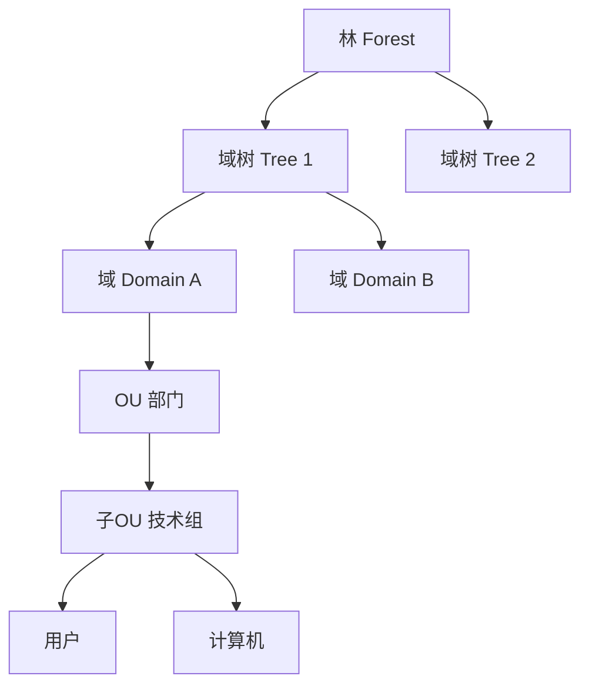
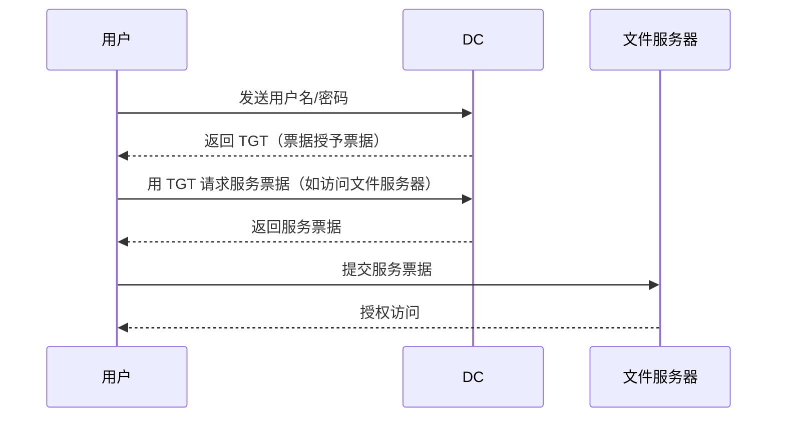
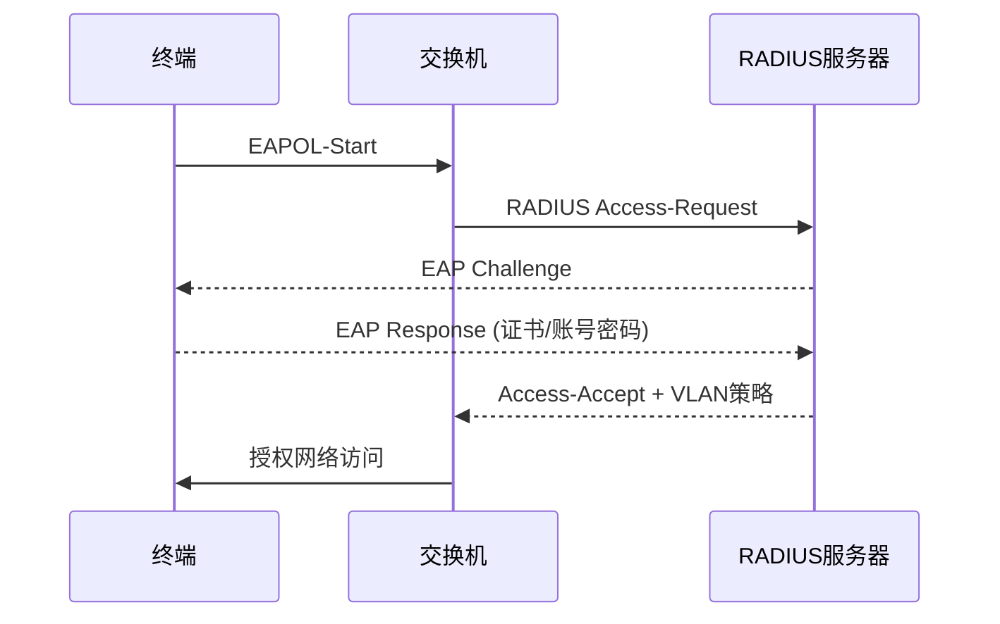
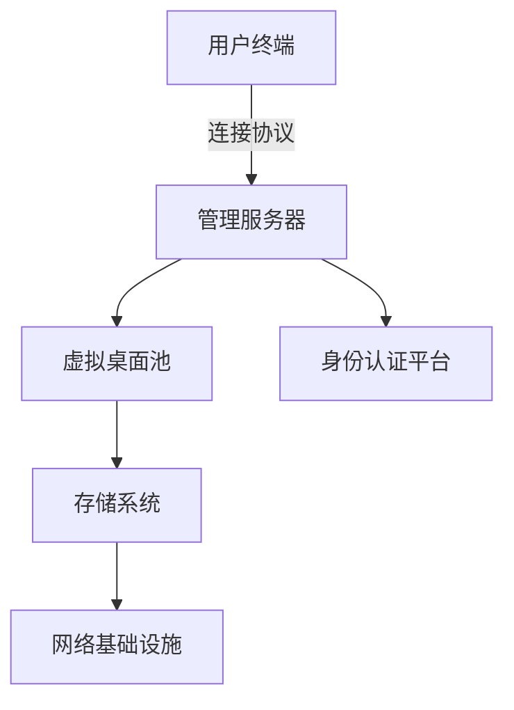
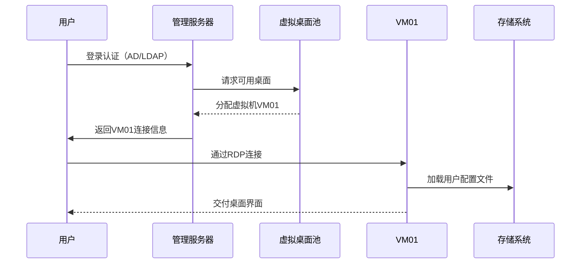
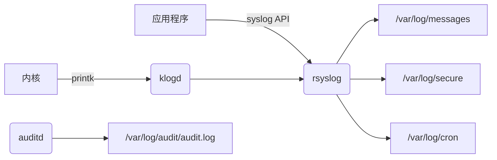
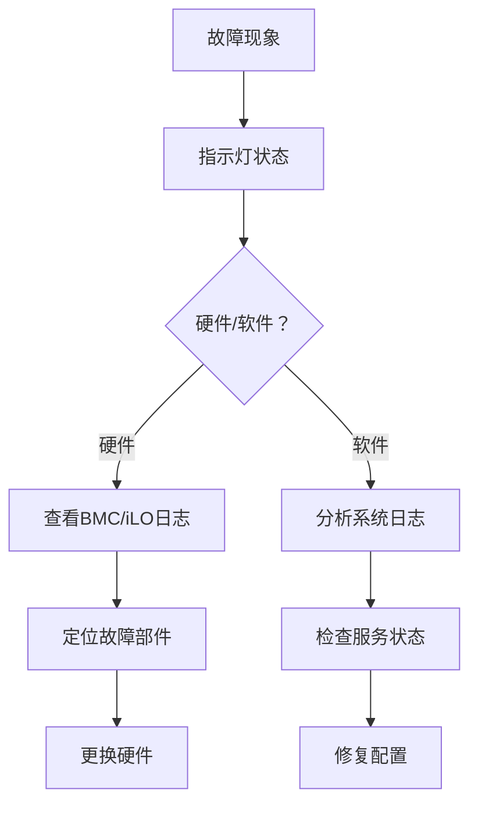

# 桌面运维工程师

## 总览（初级）

### 脚本语言

- [Shell](Shell)
- [Python](#Python)
### 运维工具

- [流程、运维、监控、配置平台](#流程、运维、监控、配置平台)
### 中间件

- [Nginx](#Nginx)
- [Redis](#Redis)
- [Tomcat](#Tomcat)
- [Tongweb](#Tongweb)
### 数据库

- [数据库基础](#数据库基础)
- [Oracle](#Oracle)
- [Mysql](#Mysql)
- [国产改造](#国产改造)
### 虚拟化

- [VMWare/FC](#VMWare/FC)
- [Docker/K8s](#Docker/K8s)
### 终端安全

- [主机安全](#主机安全)
- [终端管理](#终端管理)
### 操作系统

- [Linux/Kylin](#Linux/Kylin)
- [Windows](#Windows)
### 服务器

- [服务器基础](#服务器基础)
### 网络

- [网络基础](#网络基础)


<h2 id="Shell">Shell</h2>
1、脚本声明与注释


```bash
#!/bin/bash  # 最常见，使用 Bash 解释器
#!/bin/sh    # 使用系统默认的 Shell（可能是 Bash 的兼容模式，也可能是更简单的如 dash）
# 这是一个单行注释
echo "Hello"  # 这也是一个注释（在命令之后）
```
2、变量
```bash
MY_NAME="Alice" # 变量名通常为大写，非必须
COUNT=10 # 等号两侧不带空格
FILE_PATH="/home/user/docs/file.txt" # 值可以是数字、字符串（引号非必须，但推荐处理空格或特殊字符时使用）
```
3、引号
```bash
# 单引号 ('): 强引用。引号内所有字符都按字面意义解释，变量和命令替换不会发生。
echo '$HOME is your home' # 输出 $HOME is your home
 #双引号 ("): 弱引用。引号内允许变量扩展 ($var)、命令替换 (`command` 或 $(command)) 和转义字符 (\)。是最常用的引号。
bash echo "Your home is $HOME" # 输出 Your home is /home/username
echo "Date: $(date)"     # 输出 Date: Fri Jun 20 12:34:56 UTC 2025
# 反引号 (`): 用于命令替换（将命令的输出作为字符串）。推荐使用更清晰且支持嵌套的 $(command) 形式。
bash
OLD_STYLE=`date`      # 旧方式
NEW_STYLE=$(date)     # 推荐方式
```
4、输入输出
```bash
# 输出 (echo): 最常用的输出命令。
bash
echo "Hello World"
echo -e "Line1\nLine2"  # -e 启用反斜杠转义（如 \n 换行）
# 输出 (printf): 提供更精确的格式化输出（类似 C 语言的 printf）。
bash
printf "Name: %-10s Age: %d\n" "Alice" 30 # 格式化输出
# 输入 (read): 从标准输入（通常是键盘）或文件读取数据到变量。
bash
read -p "Enter your name: " USER_NAME # -p 显示提示符
echo "Hello, $USER_NAME!"
```
5、条件判断
```bash
if [ condition ]; then # 注意 [ 后和 ] 前必须有空格
    # commands if true
elif [ another_condition ]; then
    # commands if elif true
else
    # commands if false
fi
```
6、循环
```bash
# for循环-列表
for fruit in apple banana orange; do
    echo "I like $fruit"
done
# for循环-命令输出
for file in $(ls *.txt); do # 遍历当前目录下所有 .txt 文件
    echo "Processing $file"
done
# while循环
count=1
while [ $count -le 5 ]; do # 使用 [ ]
# while [[ $count -le 5 ]]; do # 使用 [[ ]]
    echo "Count: $count"
    count=$((count + 1))    # 算术运算
done
# until循环
count=1
until [ $count -gt 5 ]; do
    echo "Count: $count"
    count=$((count + 1))
done
```
7、函数
```bash
function say_hello() {  # 'function' 关键字可选
    local name="$1"     # 'local' 使变量只在函数内可见。$1 是函数的第一个参数
    echo "Hello, $name!"
}
say_hello "Bob"
```
8、重定向与管道
```bash
>: 覆盖输出重定向 (command > file 将 command 的 stdout 覆盖到 file)。
>>: 追加输出重定向 (command >> file 将 command 的 stdout 追加到 file)。
<: 输入重定向 (command < file 从 file 读取输入给 command)。
2>: 错误输出重定向 (command 2> error.log 将 stderr 重定向到 error.log)。
&> 或 > file 2>&1: 将 stdout 和 stderr 都重定向到 file。
|: 管道 (command1 | command2 将 command1 的 stdout 作为 command2 的 stdin)。
```
9、系统监控
```bash
top
free
iostat
```
10、磁盘与网络
```bash
df
du
lsblk
fdisk
mount

ifconfig
ping
netstat
iptables
```
11、用户与权限
```bash
useradd\mod\del
passwd
groupadd
id
su
sudo
chmod
chown
umask
```
<h2 id="Python">Python</h2>

<h2 id="流程、运维、监控、配置平台">流程、运维、监控、配置平台</h2> 

<h2 id="Nginx">Nginx</h2> 
1、基础介绍

```
定位：高性能的开源 Web 服务器 + 反向代理 + 负载均衡器 + HTTP 缓存。
核心优势：
高并发：事件驱动架构（Epoll/Kqueue），轻松应对万级并发连接。
低资源消耗：内存占用远低于传统服务器（如 Apache）。
模块化设计：通过模块扩展功能（如 SSL、压缩、流媒体）。
典型用途：
托管静态资源（HTML/CSS/JS/图片）
反向代理转发请求到后端应用（Tomcat/Python/Node.js）
负载均衡分发流量到多台服务器
终结 SSL/TLS 加密（HTTPS）
实现 URL 重写、访问控制、缓存加速
```
2、常用命令
```bash
nginx -t	# 检查配置文件语法	
nginx -s reload	# 平滑重载配
nginx -s stop	# 立即停止服务	
systemctl status nginx	# 查看服务状态	
tail -f /var/log/nginx/access.log	# 实时监控访问日志	
ss -tulnp | grep nginx	# 查看 Nginx 监听端口	
```
3、nginx.conf
```nginx
user nginx;                     # 运行进程的用户/组
worker_processes auto;           # 工作进程数（通常设为 CPU 核心数）
error_log /var/log/nginx/error.log warn; # 错误日志路径与级别
pid /run/nginx.pid;              # 主进程 PID 文件位置
events {
    worker_connections 1024;     # 单个工作进程最大连接数
    use epoll;                   # 事件驱动模型（Linux 建议 epoll）
}
http {
    include /etc/nginx/mime.types;  # 文件扩展名与 MIME 类型映射
    default_type application/octet-stream; # 默认 MIME 类型

    # 日志格式
    log_format main '$remote_addr - $remote_user [$time_local] "$request" '
                    '$status $body_bytes_sent "$http_referer" '
                    '"$http_user_agent" "$http_x_forwarded_for"';

    access_log /var/log/nginx/access.log main; # 访问日志路径

    sendfile on;                  # 零拷贝传输文件（提升性能）
    tcp_nopush on;                # 优化数据包发送
    keepalive_timeout 65;         # 客户端长连接超时时间（秒）

    gzip on;                      # 开启 Gzip 压缩
    gzip_types text/plain text/css application/json; # 压缩类型

    # 包含子配置（如 server 块）
    include /etc/nginx/conf.d/*.conf;
}
server {
    listen 80;                   # 监听端口（HTTP）
    server_name example.com www.example.com; # 域名（支持通配符）

    root /var/www/html;          # 网站根目录
    index index.html index.htm;   # 默认首页文件

    # 访问控制（按需使用）
    location /admin/ {
        allow 192.168.1.0/24;    # 允许内网访问
        deny all;                 # 拒绝其他所有 IP
        auth_basic "Restricted";  # 启用基础认证
        auth_basic_user_file /etc/nginx/.htpasswd; # 认证文件
    }

    # 反向代理配置（转发到后端应用）
    location /api/ {
        proxy_pass http://backend_server; # 后端服务器地址（需提前定义 upstream）
        proxy_set_header Host $host;      # 传递原始域名
        proxy_set_header X-Real-IP $remote_addr; # 传递客户端真实 IP
    }

    # 静态文件缓存（提升性能）
    location ~* \.(jpg|png|css|js)$ {
        expires 30d;             # 客户端缓存 30 天
        add_header Cache-Control "public";
    }

    # 错误页面自定义
    error_page 404 /404.html;
    error_page 500 502 503 504 /50x.html;
}
upstream backend_server {
    server 10.0.0.1:8080 weight=3;  # 权重 3，处理更多请求
    server 10.0.0.2:8080;           # 默认权重 1
    server 10.0.0.3:8080 backup;    # 备份服务器（仅当主节点宕机时启用）

    # 负载均衡算法（默认轮询）
    # least_conn;   # 最少连接数
    # ip_hash;      # 基于客户端 IP 哈希（会话保持）
}
server {
    listen 443 ssl http2;         # 启用 HTTP/2 优化
    server_name example.com;

    ssl_certificate /etc/nginx/ssl/example.com.crt;     # 证书路径
    ssl_certificate_key /etc/nginx/ssl/example.com.key; # 私钥路径

    ssl_protocols TLSv1.2 TLSv1.3; # 禁用不安全协议
    ssl_ciphers HIGH:!aNULL:!MD5;  # 强加密套件
    ssl_prefer_server_ciphers on;  # 优先使用服务端加密套件
    ssl_session_cache shared:SSL:10m; # SSL 会话缓存
    ssl_session_timeout 10m;       # 会话超时时间

    # 强制 HTTP 跳转 HTTPS
    if ($scheme = http) {
        return 301 https://$server_name$request_uri;
    }
}
```
<h2 id="Redis">Redis</h2> 
1、非关系型数据库

```
定义：非关系型数据库，不依赖传统的关系模型（无固定表结构、无SQL语法）。
诞生背景：解决高并发、海量数据、灵活数据结构的需求（如社交网络、物联网）。

```
| 类型     | 代表数据库   | 数据结构            | 典型场景       |
| ---------- | ----------------- | ----------------------- | ------------------ |
| 键值存储 | Redis, DynamoDB   | Key-Value               | 缓存、会话存储 |
| 文档数据库 | MongoDB, CouchDB  | JSON/BSON 文档        | 内容管理、用户配置 |
| 列族数据库 | Cassandra, HBase  | 列簇（Column Families） | 时序数据、日志分析 |
| 图数据库 | Neo4j, JanusGraph | 节点+关系           | 社交网络、推荐系统 |

2、redis概念

```
定位：开源 内存型键值数据库（也可持久化），支持多种数据结构。
核心标签：
单线程模型（6.0+ 支持多线程 I/O）
响应时间 < 1ms
支持主从复制、哨兵、集群模式
官方定义：“REmote DIctionary Server”（远程字典服务）
```
3、redis

4、redis常用命令
```bash
sudo apt install redis-server # 安装
# 关键配置文件（/etc/redis/redis.conf）：
bind 0.0.0.0            # 允许远程访问（生产环境需配合防火墙）
requirepass yourpassword # 设置访问密码
maxmemory 4gb           # 最大内存限制
appendonly yes          # 开启 AOF 持久化
# 常用运维命令
redis-cli ping	#检查服务状态	→ 返回 PONG 表示正常
redis-cli info	#查看全部运行信息	info memory（只看内存）
redis-cli --stat	#实时监控操作统计	
redis-benchmark -c 100	#压力测试（100并发连接）	
KEYS *	#列出所有Key（生产禁用！）	SCAN 0 MATCH user:*（安全遍历）
BGSAVE	#后台触发 RDB 持久化
```

<h2 id="Tomcat">Tomcat</h2>
<h2 id="Tongweb">Tongweb</h2> 

| 对比维度     | TongWeb                                    | Tomcat                               |
| ------------ | ------------------------------------------ | ------------------------------------ |
| 架构定位     | 全功能企业级应用服务器（支持 EJB、JMS 等） | 轻量级 Web 服务器/Servlet 容器       |
| 规范支持     | 完整 Java EE/Jakarta EE 全栈规范           | 仅支持 Servlet/JSP（部分 J2EE 标准） |
| 性能与扩展性 | 高并发集群、Failover 容灾、动态伸缩        | 单节点受限，无原生集群管理           |
| 安全能力     | 内置可信计算、国密算法、等保四级合规       | 依赖外部安全方案，无主动防御机制     |
| 运维管理     | 提供 APM 性能诊断、热部署、集中管控台      | 需第三方工具扩展，无统一监控平台     |
| 技术服务     | 企业级售后支持（金融/政务专属团队）        | 社区支持为主，无官方保障             |


| 维度     | Tomcat                                 | Nginx                                     |
| ---------- | -------------------------------------- | ----------------------------------------- |
| 本质     | Java应用服务器（Servlet/JSP容器） | 高性能HTTP服务器/反向代理       |
| 动态处理 | ✅ 原生支持Java动态内容（Servlet/JSP） | ❌ 需通过FastCGI、uWSGI等代理后端动态语言 |
| 静态资源 | ⚠️ 可处理但效率较低        | ✅ 极高性能（事件驱动模型+零拷贝技术） |
| 企业级能力 | ✅ 支持EJB、JMS等Java EE规范    | ❌ 无内置企业级中间件支持     |


<h2 id="数据库基础">数据库基础</h2> 

SQL

DXL

sql优化

索引

事务ACID

缓存

锁

数据库审计

数据库监控

数据库函数

表结构设计


<h2 id="Oracle">Oracle</h2>

oracle安装

实例

租户

会话

表空间

权限分配

UNDO/REDO

ASM

归档

视图

位图

段与区管理机制

RMAN

导入导出工具

AWR/ASH报告分析

Listener配置与管理

TNS服务名解析配置

动态/静态注册机制

多监听与端口绑定

RAC

节点与集群服务管理

共享存储与集群文件系统配置

心跳机制与故障转移策略

DG备库同步机制

<h2 id="Mysql">Mysql</h2> 

innoDB

<h2 id="国产改造">国产改造</h2> 

各数据库特点/架构

数据导入/导出

备份/恢复

高可用

分布式

集群部署


<h2 id="VMWare/FC">VMWare/FC</h2> 

1、虚拟网络

```bash
# 桥接模式（Bridged Mode）

核心原理：虚拟机通过虚拟交换机（VMnet0）直接桥接到主机的物理网卡，获得与宿主机同一网段的独立IP地址，成为局域网中的“平等成员”。

IP分配：由物理网络的DHCP服务器分配，或手动配置静态IP（需与宿主机同网段）。

网络可见性：
✅ 虚拟机可访问局域网内所有设备及互联网；
✅ 局域网内其他设备可直接访问虚拟机（如通过SSH、Web服务）。

安全性：较低，虚拟机完全暴露在局域网中。

适用场景：
虚拟机需作为独立服务器对外提供服务（如Web服务器、数据库）；
局域网IP资源充足且允许新设备接入。

配置要点：
需确保主机物理网卡启用“VMware Bridge Protocol”3；
若主机切换网络（如从有线转无线），可勾选“复制物理网络连接状态”保持IP稳定3。

# NAT模式（Network Address Translation Mode）

核心原理：虚拟机通过虚拟网卡VMnet8连接到虚拟NAT设备，共享宿主机的公网IP访问外部网络。外部请求需经端口映射才能访问虚拟机。
特点与行为：

IP分配：由VMware内置DHCP服务分配私有IP（如192.168.xxx.xxx）
。
网络可见性：
✅ 虚拟机可单向访问互联网及局域网其他设备；
❌ 外部设备默认无法访问虚拟机（除非配置端口转发）。

安全性：中等，虚拟机隐藏于宿主机之后。

适用场景：
多虚拟机需同时上网且IP资源紧张（如开发测试环境）；
无需对外提供服务，仅需基础网络访问。

配置要点：
无需手动设置IP（默认DHCP自动分配）；

端口映射步骤：VMware虚拟网络编辑器 → NAT设置 → 添加端口转发规则。

# 仅主机模式（Host-Only Mode）

核心原理：虚拟机通过虚拟网卡VMnet1与宿主机组成封闭私有网络，完全隔离外部网络。

特点与行为：
IP分配：由VMware内置DHCP分配私有IP（或手动设置），范围与VMnet1子网一致（如192.168.137.xxx）。

网络可见性：
✅ 虚拟机可与宿主机及同一Host-Only网络的其他虚拟机通信；
❌ 无法访问互联网或外部设备（除非宿主机开启网络共享或代理）。

安全性：最高，完全隔离外部网络。

适用场景：
安全测试、漏洞实验等需严格隔离的环境；
内部网络通信测试（如集群软件调试）。

配置要点：
若需联网：在宿主机网络设置中启用“Internet连接共享”，将物理网卡共享至VMnet。
```
| 特性         | 桥接模式          | NAT模式             | 仅主机模式       |
| -------------- | --------------------- | --------------------- | --------------------- |
| IP地址来源 | 物理网络DHCP/手动配置 | VMware DHCP（私有IP） | VMware DHCP（私有IP） |
| 访问互联网 | ✅ 直接访问      | ✅ 通过宿主机NAT转换 | ❌ 默认不可（需共享） |
| 外部访问虚拟机 | ✅ 直接访问      | ❌ 需端口映射   | ❌ 不可访问      |
| 虚拟机间通信 | ✅（同网段）    | ✅（同NAT网络） | ✅（同Host-Only网络） |
| 安全性      | 低（暴露于局域网） | 中（隐藏于NAT后） | 高（完全隔离） |
| 典型场景   | 对外服务的服务器 | 开发/测试环境上网 | 安全测试/内部网络实验 |


<h2 id="Docker/K8s">Docker/K8s</h2> 
<h2 id="主机安全">主机安全</h2> 
<h2 id="终端管理">终端管理</h2> 

1、域控

```bash
# 核心概念

定义与作用:
Active Directory (AD)：微软开发的目录服务，用于集中管理网络资源（用户、计算机、策略）。
域（Domain）：AD 的基本管理单元，是安全边界和策略应用边界的集合。

核心价值：
统一身份认证：单点登录（SSO）访问所有授权资源。
集中策略管理：通过组策略（GPO）批量配置安全/软件设置。
资源组织与发现：全局编录（GC）快速搜索跨域对象。
```

| 术语        | 说明                                                              |
| ------------- | ------------------------------------------------------------------- |
| 域控制器 (DC) | 运行 AD DS 服务的服务器，存储域数据库（ntds.dit），处理认证请求。 |
| 林 (Forest)  | 由一个或多个域组成的最大安全边界，共享架构（Schema）和全局编录。 |
| 树 (Tree)    | 具有连续 DNS 命名空间的域集合（如 parent.com → child.parent.com）。 |
| 信任 (Trust) | 域间关系，允许跨域认证（如：单向信任、双向信任、林信任）。 |
| OU (组织单元) | 容器对象，用于分层管理用户/计算机/组，是组策略的最小应用单位。 |
| 组策略 (GPO) | 批量配置用户/计算机的规则集合（如密码策略、软件部署）。 |


身份认证



组策略

| 策略       | 作用                      | 示例配置项                        |
| ------------ | --------------------------- | -------------------------------------- |
| 密码策略 | 强制密码复杂度       | 最小长度8，90天更换            |
| 软件部署 | 自动安装/卸载应用   | 推送Chrome到市场部OU             |
| 文件夹重定向 | 将桌面/文档同步到文件服务器 | \\FS01\UserProfiles\%username%         |
| 登录脚本 | 用户登录时自动执行 | 映射网络驱动器 net use Z: \\FS01\Share |
| 策略       | 作用                      | 示例配置项                        |


2、准入

```bash
准入控制（Network Access Control, NAC）是网络安全的核心边界防御机制，其核心原理可概括为：“未知设备不入网，非标终端不通行”。它通过预连接策略验证设备安全状态，实现网络访问的动态授权。

三大核心原理：
认证（Authentication）
授权（Authorization）
合规检查（Posture Assessment）
```

### 认证（Authentication）

802.1x协议

非802.1X方案：

Web认证门户：访客设备浏览器重定向至认证页

MAC旁路认证：打印机/IoT设备白名单

### 授权（Authorization）

目的：动态分配访问权限

| 策略类型 | 控制粒度         | 应用场景                                            |
| -------- | -------------------- | ------------------------------------------------------- |
| VLAN划分 | 隔离不同安全等级终端 | 员工VLAN（10.1.0.0/16） vs 访客VLAN（192.168.100.0/24） |
| ACL过滤 | 限制IP/端口访问 | 研发部禁止访问外网存储服务                 |
| 带宽限制 | QoS保障关键业务 | 视频会议流量优先于P2P下载                    |


3、桌管

4、虚拟桌面

```bash
虚拟桌面（Virtual Desktop）是一种将传统PC的桌面环境（操作系统、应用程序、用户数据）从本地设备迁移到集中式服务器或云端，通过网络交付给终端用户的计算模型。其核心思想是“集中计算，分布显示”，用户通过瘦客户端、PC或移动设备远程访问完整的桌面体验。
虚拟桌面通过服务器虚拟化技术在数据中心创建多个虚拟机（VM），每个VM运行独立的桌面操作系统（如Windows/Linux）。用户通过远程桌面协议（如RDP、PCoIP、SPICE）访问这些虚拟机，实现与传统PC无差别的操作体验。
```

| 维度   | 传统PC               | 虚拟桌面               |
| -------- | ---------------------- | -------------------------- |
| 数据安全 | 数据分散在终端，易泄露 | 数据集中存储，加密隔离 |
| 运维成本 | 逐台维护，成本高昂 | 集中管理，批量部署与更新 |
| 移动性 | 依赖特定设备     | 多终端接入（PC/平板/手机） |
| 资源弹性 | 硬件固定，升级困难 | 动态分配CPU/内存/存储 |



| 架构 | 计算位置 | 存储位置 | 优势                 | 典型场景        |
| ---- | ---------- | ------------ | ---------------------- | ------------------- |
| VDI  | 集中服务器 | 集中存储 | 数据安全高，移动性强 | 金融/远程办公 |
| IDV  | 本地终端 | 集中+本地 | 外设兼容性好，断网可用 | 制造业/实验室 |
| TCI  | 本地终端 | 本地虚拟磁盘 | 极致外设兼容性  | 3D设计/高性能工作站 |
| RDS  | 集中服务器 | 集中存储 | 成本低，部署简单 | 呼叫中心/图书馆终端 |



<h2 id="Linux/Kylin">Linux/Kylin</h2> 
1、linux文件目录

| 目录 | 用途                         | 关键内容示例            |
| ------ | ------------------------------ | ----------------------------- |
| /      | 根目录，所有目录的起点 |                               |
| /bin   | 基础命令（所有用户可用） | ls, cp, cat                   |
| /sbin  | 系统管理命令（仅 root 可用） | fdisk, ifconfig, iptables     |
| /etc   | 系统配置文件             | passwd, fstab, nginx.conf     |
| /var   | 动态变化数据             | log/, lib/, www/              |
| /tmp   | 临时文件（自动清理） |                               |
| /home  | 普通用户家目录          | user1/, user2/                |
| /root  | root 用户家目录           |                               |
| /usr   | 用户程序与资源（只读） | bin/, lib/, include/          |
| /opt   | 第三方软件安装目录    | google/chrome/                |
| /dev   | 设备文件                   | sda, ttyS0, null              |
| /proc  | 内核和进程信息（虚拟文件系统） | cpuinfo, meminfo, 1/（PID 1） |
| /sys   | 系统硬件信息（虚拟文件系统） | class/, devices/              |
| /boot  | 启动文件                   | vmlinuz, initramfs, grub/     |
| /mnt   | 临时挂载点                |                               |
| /media | 可移动设备挂载点       | cdrom/, usb/                  |
2、重要配置文件
```bash
/etc/passwd       # 用户账户信息
/etc/shadow       # 加密密码（仅root可读）
/etc/group        # 用户组信息
/etc/hosts        # 本地域名解析
/etc/fstab        # 文件系统挂载配置
/etc/resolv.conf  # DNS服务器配置
```
3、软件包管理
```bash
Debian/Ubuntu	
apt install nginx	# 安装软件
apt remove nginx	# 卸载软件
apt update	# 更新软件源列表
apt upgrade	# 升级所有软件
RHEL/CentOS	
yum install httpd	# 安装软件
yum remove httpd	# 卸载软件
yum update	# 升级所有软件
通用	
dpkg -i pkg.deb	# 手动安装Deb包
rpm -ivh pkg.rpm	# 手动安装RPM包
```
4、服务管理
```bash
# 服务操作
systemctl start nginx    # 启动服务
systemctl stop nginx     # 停止服务
systemctl restart nginx  # 重启服务
systemctl reload nginx   # 重载配置（不中断）
systemctl enable nginx   # 设置开机自启
systemctl disable nginx  # 禁用开机自启

# 服务状态查看
systemctl status nginx   # 详细状态
systemctl is-active nginx # 是否运行中
journalctl -u nginx -f   # 实时查看日志
```
5、日志系统

| 日志文件             | 记录内容                  |
| ------------------------ | ----------------------------- |
| /var/log/messages        | 常规系统消息（CentOS/RHEL） |
| /var/log/syslog          | 常规系统消息（Debian/Ubuntu） |
| /var/log/auth.log        | 认证日志（登录、sudo） |
| /var/log/secure          | 安全日志（RHEL系）     |
| /var/log/kern.log        | 内核日志                  |
| /var/log/audit/audit.log | 审计日志（需auditd服务） |
6、性能调优

| 参数                       | 默认值 | 优化值 | 作用             |
| ---------------------------- | ------ | ------- | ------------------ |
| net.core.somaxconn           | 128    | 4096    | TCP连接队列长度 |
| net.ipv4.tcp_tw_reuse        | 0      | 1       | 重用TIME_WAIT连接 |
| vm.swappiness                | 60     | 10      | 减少Swap使用   |
| fs.file-max                  | 79322  | 2097152 | 最大文件句柄数 |
| net.ipv4.tcp_max_syn_backlog | 128    | 8192    | SYN队列长度    |
| vm.dirty_ratio               | 20     | 10      | 减少写缓冲脏页比例 |
<h2 id="Windows">Windows</h2> 
1、用户与组

| 操作类型 | 图形界面路径               | 命令行工具 | 关键命令示例                      |
| ---------- | -------------------------------- | -------------- | --------------------------------------- |
| 创建用户 | 计算机管理 → 本地用户和组 → 用户 | net user       | net user John P@ssw0rd /add             |
| 删除用户 | 同上                           | 同上         | net user John /del                      |
| 修改密码 | 同上 → 右键用户 → 设置密码 | 同上         | net user John * (交互式修改)       |
| 加入用户组 | 用户属性 → 隶属于 → 添加 | net localgroup | net localgroup Administrators John /add |

2、组策略管理（GPO）

应用场景：统一配置域内计算机（如密码策略、软件部署）

操作路径：
```bash
gpedit.msc  # 本地组策略编辑器
计算机配置/用户配置 → 策略模板
```
3、服务与进程管理

| 操作       | 图形界面            | 命令行（sc）               | PowerShell                                       |
| ------------ | ----------------------- | ------------------------------- | ------------------------------------------------ |
| 启动服务 | services.msc → 右键启动 | sc start "Spooler"              | Start-Service -Name Spooler                      |
| 停止服务 | 同上 → 停止       | sc stop "Spooler"               | Stop-Service -Name Spooler                       |
| 设置启动类型 | 属性 → 启动类型 | sc config "Spooler" start= auto | Set-Service -Name Spooler -StartupType Automatic |
```cmd

进程监控与终止
任务管理器：Ctrl+Shift+Esc → 查看CPU/内存占用
命令行终结进程：
tasklist | findstr "malware.exe"  # 查找进程ID
taskkill /F /PID 1234             # 强制终止进程
资源监视器：resmon.exe（分析进程的文件/网络活动）
```

4、事件日志

| 日志类型 | 路径                          | 主要用途          |
| ------------ | ------------------------------- | --------------------- |
| 系统日志 | 事件查看器 → Windows日志 → 系统 | 服务启动失败/硬件错误 |
| 应用程序日志 | 同上 → 应用程序         | 软件崩溃/兼容性问题 |
| 安全日志 | 同上 → 安全               | 登录审计/权限变更记录 |
| Setup日志  | 同上 → Setup                | 系统更新/补丁安装问题 |

5、本地安全策略

本地安全策略（secpol.msc）
| 配置项    | 路径                  | 企业应用                             |
| ------------ | ----------------------- | ---------------------------------------- |
| 账户策略 | 账户策略 → 密码策略 | 强制密码复杂度+最长使用期限 |
| 用户权限分配 | 本地策略 → 用户权限分配 | 禁止普通用户关机（Shut down the system） |
| 安全审计 | 高级审计策略 → 审计策略 | 启用文件删除审计           

| 维度     | 组策略（GPO）              | 本地安全策略           |
| ---------- | ------------------------------- | ---------------------------- |
| 作用范围 | 支持域/OU/本地             | 仅本地计算机           |
| 配置颗粒度 | 可配置软件部署/IE设置等非安全项 | 专注账户/审计/权限等安全设置 |
| 优先级  | 域策略 > OU策略 > 本地策略 | 属于本地策略的一部分 |

<h2 id="服务器基础">服务器基础</h2> 

1、部署流程


2、CPU

| 术语   | 说明                                | 计算公式                    |
| -------- | ------------------------------------- | ------------------------------- |
| 物理CPU | 插在主板上的实体处理器     |                                 |
| 物理核心 | 单个CPU内的独立计算单元     |                                 |
| 逻辑CPU | 通过超线程（Hyper-Threading）虚拟的核 | 逻辑CPU数 = 物理核心数 × 线程数 |

3、存储

| 类型   | 原理          | 接口   | 适用场景      | 寿命/性能          |
| -------- | --------------- | -------- | ----------------- | ---------------------- |
| HDD      | 机械磁头读写 | SATA/SAS | 冷数据存储   | 寿命长，IOPS低（<200） |
| SATA SSD | 闪存芯片    | SATA     | 普通应用服务器 | DWPD 0.3-1，IOPS 50K  |
| NVMe SSD | PCIe通道直连CPU | M.2/U.2  | 数据库/高性能计算 | DWPD 1-3，IOPS 500K+  |
| SAS SSD  | 企业级闪存 | SAS 12Gb | 企业级存储阵列 | DWPD 3-10，IOPS 200K  |

4、内存

| 参数  | 说明                  | 示例值   | 影响               |
| ------- | ----------------------- | ----------- | -------------------- |
| 容量  | 单条内存大小      | 32GB        | 决定并发处理能力 |
| 频率  | 数据传输速度      | DDR4-3200   | 高频提升CPU-内存带宽 |
| 时序  | 延迟参数（CL-tRCD-tRP） | CL16-18-18  | 低时序减少延迟 |
| ECC支持 | 错误校验纠正      | ECC/Non-ECC | 关键业务必需   |

5、带外管理

| 技术 | 厂商   | 访问方式   | 核心功能                 |
| ----- | -------- | -------------- | ---------------------------- |
| iDRAC | Dell     | Web/https://IP | 硬件监控、远程控制、日志导出 |
| iLO   | HPE      | Java/iLO App   | 虚拟KVM、电源管理、固件更新 |
| BMC   | 通用标准 | IPMI工具     | 基础硬件监控           |

6、排障流程




<h2 id="网络基础">网络基础</h2> 

1、TCP/IP四层模型

| 层级     | 功能                 | 核心协议              | 传输单元  | 设备示例       |
| ---------- | ---------------------- | ------------------------- | ------------- | ------------------ |
| 应用层  | 提供用户接口和服务 | HTTP, FTP, DNS, SMTP, SSH | 数据流     | 浏览器、邮件客户端 |
| 传输层  | 端到端连接、可靠性保障 | TCP, UDP                  | 段（Segment） | 防火墙、负载均衡器 |
| 网络层  | 寻址和路由选择  | IP, ICMP, ARP, OSPF       | 包（Packet） | 路由器          |
| 网络接口层 | 物理传输、帧封装 | Ethernet, Wi-Fi, PPP      | 帧（Frame） | 交换机、网卡 |

```bash
# 应用层（Application Layer）
作用：直接面向应用程序，提供网络服务接口

协议示例：
HTTP：网页传输（GET /index.html）
DNS：域名解析（将 www.baidu.com → 180.101.49.12）
SSH：加密远程登录（ssh user@192.168.1.1）

数据单元：原始数据流（如 JSON 文本、图片二进制流）

# 传输层（Transport Layer）
作用：建立端到端连接，保障数据传输可靠性

核心协议对比：
特性	TCP	UDP
连接方式	面向连接（三次握手）	无连接
可靠性	丢包重传、数据排序	不保证可靠传输
速度	慢（需确认机制）	快
头部大小	20字节	8字节
适用场景	网页、邮件、文件传输	视频流、DNS查询、游戏数据

端口号：标识应用程序（如 80→HTTP，443→HTTPS）

# 网络层（Internet Layer）
作用：逻辑寻址（IP地址）和路由选择

核心协议：
IP：无连接的数据包传输（IPv4/IPv6）
ICMP：网络诊断（ping、traceroute）
ARP：IP地址 → MAC地址解析（局域网通信基础）

IP 地址示例：
IPv4：192.168.1.100（32位，点分十进制）
IPv6：2001:0db8:85a3::8a2e:0370:7334（128位，十六进制）

# 网络接口层（Network Interface Layer）
作用：物理介质访问、帧封装/解封装

核心技术：
MAC 地址：硬件唯一标识（如 00:1A:C2:7B:00:47）

以太网帧结构：
| 目标MAC (6B) | 源MAC (6B) | 类型 (2B) | 数据 (46-1500B) | CRC (4B) |
MTU：最大传输单元（以太网默认1500字节）

```

2、常见协议

网络服务协议

| 协议 | 端口 | 传输层 | 用途                 | 安全建议             |
| ------ | ---- | ------- | ---------------------- | ------------------------ |
| HTTP   | 80   | TCP     | 网页传输（明文） | 必须升级HTTPS        |
| HTTPS  | 443  | TCP     | 加密网页传输     | 定期更新TLS证书    |
| DNS    | 53   | UDP/TCP | 域名解析           | 启用DNSSEC防劫持    |
| SSH    | 22   | TCP     | 加密远程管理     | 禁用密码登录，用密钥认证 |
| Telnet | 23   | TCP     | 明文远程登录（危险！） | 生产环境禁用       |
| Ping   | -    | ICMP    | 网络连通测试     | 限制ICMP速率防洪水攻击 |

文件传输协议

| 协议 | 端口   | 传输层 | 用途                | 安全加固方法      |
| ---- | ----- | ------- | --------------------- | ----------------------- |
| FTP  |   21(控制)      20(数据)| TCP     | 文件传输（明文） | 改用SFTP/FTPS         |
| SFTP | 22       | TCP     | 基于SSH的加密文件传输 | 限制用户目录（Chroot） |
| FTPS | 989/990  | TCP     | FTP over TLS          | 强制使用TLS 1.2+    |
| NFS  | 2049     | TCP/UDP | 网络文件共享    | 用Kerberos认证（NFSv4） |
| SMB  | 445      | TCP     | Windows文件共享   | 启用SMB加密         |

邮件协议

| 协议   | 端口 | 加密端口 | 用途               | 部署建议        |
| -------- | ---- | -------- | -------------------- | ------------------- |
| SMTP     | 25   | 465/587  | 邮件发送         | 端口587启用STARTTLS |
| POP3     | 110  | 995      | 收邮件（下载到本地） | 强制使用SSL     |
| IMAP     | 143  | 993      | 收邮件（服务器存储） | 默认禁用明文端口 |
| Exchange | 443  | -        | MAPI over HTTPS      | 仅开放HTTPS端口 |

数据库协议

| 数据库  | 默认端口 | 传输层 | 暴露风险                | 防护措施             |
| ---------- | -------- | ------ | --------------------------- | ------------------------ |
| MySQL      | 3306     | TCP    | SQL注入/未授权访问   | 限制IP白名单 + SSL加密 |
| PostgreSQL | 5432     | TCP    | 漏洞利用（如CVE-2019-9193） | 启用SCRAM认证        |
| Redis      | 6379     | TCP    | 未授权访问导致勒索 | 绑定127.0.0.1 + 设置密码 |
| Oracle     | 1521     | TCP    | TNS劫持攻击             | 配置sqlnet.ora加密   |

3、TCP连接过程

| 字段 | 首次握手（SYN） | 第二次握手（SYN+ACK） | 第三次握手（ACK） |
| ---- | --------------- | --------------------- | ----------------- |
| SYN  | 1               | 1                     | 0                 |
| ACK  | 0               | 1                     | 1                 |
| Seq  | x（随机初始化） | y（随机初始化） | x+1               |
| Ack  | 0               | x+1                   | y+1          
|Win	|客户端窗口大小|	服务端窗口大小|	客户端窗口大小|

| 报文     | 标志位   | 序列号 | 确认号 | 状态变化            |
| ---------- | ----------- | ------- | ------- | ----------------------- |
| 第一次挥手 | FIN=1       | Seq=u   | Ack=v   | A: ESTAB→FIN_WAIT_1   |
| 第二次挥手 | ACK=1       | Seq=v   | Ack=u+1 | B: ESTAB→CLOSE_WAIT   |
| 第三次挥手 | FIN=1,ACK=1 | Seq=w   | Ack=u+1 | B: CLOSE_WAIT→LAST_ACK |
| 第四次挥手 | ACK=1       | Seq=u+1 | Ack=w+1 | A: FIN_WAIT_2→TIME_WAIT |

```bash
# 为什么是三次握手
防止历史连接初始化：若客户端发出的旧SYN报文因网络延迟晚到，服务端响应后，客户端可根据上下文判断并发送RST终止旧连接（两次握手无法实现此机制）。

# 为什么是四次挥手

TCP 是全双工协议，每个方向需独立关闭：
主动方发 FIN → 关闭发送通道（仍可接收数据）
被动方先 ACK → 确认收到关闭请求
被动方发 FIN → 关闭自身发送通道
主动方 ACK → 确认最终关闭
```

4、拥塞与流量控制

```bash
# 流量控制：滑动窗口

接收方通过 TCP 头部的 Window Size 字段通告剩余缓冲区大小（单位：字节）
发送方根据窗口值动态调整发送速率（发送窗口 ≤ 接收窗口）

零窗口问题与解决
现象：接收方缓冲区满 → 通告 Win=0
探活机制：发送方启动 持续定时器（Persist Timer），定时发送 ZWP（Zero Window Probe） 报文（1字节数据），检测窗口恢复情况。
```
拥塞控制 

| 算法   | 触发条件    | 行为                                | 适用场景     |
| -------- | --------------- | ------------------------------------- | ---------------- |
| 慢启动 | 连接初始化 | 窗口呈指数增长（cwnd *= 2）  | 新连接建立  |
| 拥塞避免 | cwnd ≥ ssthresh | 窗口线性增长（cwnd += 1）     | 稳定传输阶段 |
| 快速重传 | 收到3个重复ACK | 立即重传丢失包，不等待超时 | 轻微丢包     |
| 快速恢复 | 快速重传后 | cwnd = ssthresh + 3，进入拥塞避免阶段 | 配合快速重传使用 |

5、OSI协议

| 层级        | 功能描述                | 代表协议/技术                            | 数据传输单元 | 设备示例       |
| ------------- | --------------------------- | ---------------------------------------------- | ------------- | ------------------ |
| 1. 物理层  | 比特流传输（电信号/光信号） | RS-232, RJ45, 光纤, IEEE 802.3（以太网物理层） | 比特（Bit） | 集线器、中继器 |
| 2. 数据链路层 | 帧封装、MAC寻址、差错控制 | 以太网（Ethernet II）, PPP, MAC地址, VLAN | 帧（Frame） | 交换机、网桥 |
| 3. 网络层  | 逻辑寻址（IP）、路由选择 | IP, ICMP, ARP, OSPF, BGP                       | 包（Packet） | 路由器          |
| 4. 传输层  | 端到端连接、可靠性保障 | TCP, UDP, TLS/SSL                              | 段（Segment） | 防火墙、负载均衡器 |
| 5. 会话层  | 建立/管理/终止会话  | NetBIOS, RPC, SSH隧道管理                  | 数据（Data） | （通常由软件实现） |
| 6. 表示层  | 数据格式转换、加密/压缩 | SSL/TLS（加密）, JPEG, MPEG, ASCII         | 数据（Data） | （软件库实现） |
| 7. 应用层  | 用户接口、网络服务 | HTTP, FTP, DNS, SMTP, SSH                      | 数据（Data） | 应用程序       |

| 层级     | 对应OSI层             | 核心协议            |
| ---------- | ------------------------ | ----------------------- |
| 网络接口层 | 物理层 + 数据链路层 | Ethernet, Wi-Fi, ARP    |
| 网络层  | 网络层                | IP, ICMP, BGP           |
| 传输层  | 传输层                | TCP, UDP, QUIC          |
| 应用层  | 会话层 + 表示层 + 应用层 | HTTP, DNS, TLS/SSL, RTP |

| 维度      | OSI模型                    | TCP/IP模型                  |
| ----------- | ---------------------------- | ----------------------------- |
| 设计目标 | 理论通用框架（理想化） | 解决实际问题（源于ARPANET） |
| 层级结构 | 严格七层，边界清晰  | 四层，灵活实用         |
| 协议绑定 | 未指定具体协议        | 与IP/TCP/UDP等协议强绑定 |
| 实际影响力 | 学术标准，用于教学和理论分析 | 互联网运行基础         |
| 会话/表示层 | 独立定义会话管理和数据格式 | 合并到应用层（如TLS处理加密） |

