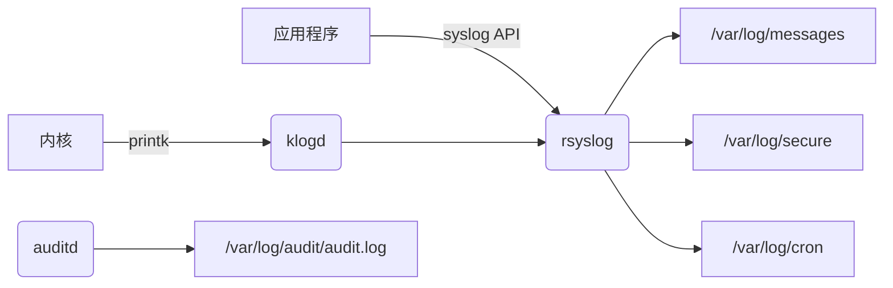

# 桌面运维工程师

## 总览（初级）

### 脚本语言

- [Shell](Shell)
- [Python](#Python)
### 运维工具

- [流程、运维、监控、配置平台](#流程、运维、监控、配置平台)
### 中间件

- [Nginx](#Nginx)
- [Redis](#Redis)
- [Tomcat](#Tomcat)
- [Tongweb](#Tongweb)
### 数据库

- [数据库基础](#数据库基础)
- [Oracle](#Oracle)
- [Mysql](#Mysql)
- [国产改造](#国产改造)
### 虚拟化

- [VMWare/FC](#VMWare/FC)
- [Docker/K8s](#Docker/K8s)
### 终端安全

- [主机安全](#主机安全)
- [终端管理](#终端管理)
### 操作系统

- [Linux/Kylin](#Linux/Kylin)
- [Windows](#Windows)
### 服务器

- [服务器基础](#服务器基础)
### 网络

- [网络基础](#网络基础)


<h2 id="Shell">Shell</h2>
1、脚本声明与注释


```bash
#!/bin/bash  # 最常见，使用 Bash 解释器
#!/bin/sh    # 使用系统默认的 Shell（可能是 Bash 的兼容模式，也可能是更简单的如 dash）
# 这是一个单行注释
echo "Hello"  # 这也是一个注释（在命令之后）
```
2、变量
```bash
MY_NAME="Alice" # 变量名通常为大写，非必须
COUNT=10 # 等号两侧不带空格
FILE_PATH="/home/user/docs/file.txt" # 值可以是数字、字符串（引号非必须，但推荐处理空格或特殊字符时使用）
```
3、引号
```bash
# 单引号 ('): 强引用。引号内所有字符都按字面意义解释，变量和命令替换不会发生。
echo '$HOME is your home' # 输出 $HOME is your home
 #双引号 ("): 弱引用。引号内允许变量扩展 ($var)、命令替换 (`command` 或 $(command)) 和转义字符 (\)。是最常用的引号。
bash echo "Your home is $HOME" # 输出 Your home is /home/username
echo "Date: $(date)"     # 输出 Date: Fri Jun 20 12:34:56 UTC 2025
# 反引号 (`): 用于命令替换（将命令的输出作为字符串）。推荐使用更清晰且支持嵌套的 $(command) 形式。
bash
OLD_STYLE=`date`      # 旧方式
NEW_STYLE=$(date)     # 推荐方式
```
4、输入输出
```bash
# 输出 (echo): 最常用的输出命令。
bash
echo "Hello World"
echo -e "Line1\nLine2"  # -e 启用反斜杠转义（如 \n 换行）
# 输出 (printf): 提供更精确的格式化输出（类似 C 语言的 printf）。
bash
printf "Name: %-10s Age: %d\n" "Alice" 30 # 格式化输出
# 输入 (read): 从标准输入（通常是键盘）或文件读取数据到变量。
bash
read -p "Enter your name: " USER_NAME # -p 显示提示符
echo "Hello, $USER_NAME!"
```
5、条件判断
```bash
if [ condition ]; then # 注意 [ 后和 ] 前必须有空格
    # commands if true
elif [ another_condition ]; then
    # commands if elif true
else
    # commands if false
fi
```
6、循环
```bash
# for循环-列表
for fruit in apple banana orange; do
    echo "I like $fruit"
done
# for循环-命令输出
for file in $(ls *.txt); do # 遍历当前目录下所有 .txt 文件
    echo "Processing $file"
done
# while循环
count=1
while [ $count -le 5 ]; do # 使用 [ ]
# while [[ $count -le 5 ]]; do # 使用 [[ ]]
    echo "Count: $count"
    count=$((count + 1))    # 算术运算
done
# until循环
count=1
until [ $count -gt 5 ]; do
    echo "Count: $count"
    count=$((count + 1))
done
```
7、函数
```bash
function say_hello() {  # 'function' 关键字可选
    local name="$1"     # 'local' 使变量只在函数内可见。$1 是函数的第一个参数
    echo "Hello, $name!"
}
say_hello "Bob"
```
8、重定向与管道
```bash
>: 覆盖输出重定向 (command > file 将 command 的 stdout 覆盖到 file)。
>>: 追加输出重定向 (command >> file 将 command 的 stdout 追加到 file)。
<: 输入重定向 (command < file 从 file 读取输入给 command)。
2>: 错误输出重定向 (command 2> error.log 将 stderr 重定向到 error.log)。
&> 或 > file 2>&1: 将 stdout 和 stderr 都重定向到 file。
|: 管道 (command1 | command2 将 command1 的 stdout 作为 command2 的 stdin)。
```
9、系统监控
```bash
top
free
iostat
```
10、磁盘与网络
```bash
df
du
lsblk
fdisk
mount

ifconfig
ping
netstat
iptables
```
11、用户与权限
```bash
useradd\mod\del
passwd
groupadd
id
su
sudo
chmod
chown
umask
```
<h2 id="Python">Python</h2>

<h2 id="流程、运维、监控、配置平台">流程、运维、监控、配置平台</h2> 

<h2 id="Nginx">Nginx</h2> 
1、基础介绍

```
定位：高性能的开源 Web 服务器 + 反向代理 + 负载均衡器 + HTTP 缓存。
核心优势：
高并发：事件驱动架构（Epoll/Kqueue），轻松应对万级并发连接。
低资源消耗：内存占用远低于传统服务器（如 Apache）。
模块化设计：通过模块扩展功能（如 SSL、压缩、流媒体）。
典型用途：
托管静态资源（HTML/CSS/JS/图片）
反向代理转发请求到后端应用（Tomcat/Python/Node.js）
负载均衡分发流量到多台服务器
终结 SSL/TLS 加密（HTTPS）
实现 URL 重写、访问控制、缓存加速
```
2、常用命令
```bash
nginx -t	# 检查配置文件语法	
nginx -s reload	# 平滑重载配
nginx -s stop	# 立即停止服务	
systemctl status nginx	# 查看服务状态	
tail -f /var/log/nginx/access.log	# 实时监控访问日志	
ss -tulnp | grep nginx	# 查看 Nginx 监听端口	
```
3、nginx.conf
```nginx
user nginx;                     # 运行进程的用户/组
worker_processes auto;           # 工作进程数（通常设为 CPU 核心数）
error_log /var/log/nginx/error.log warn; # 错误日志路径与级别
pid /run/nginx.pid;              # 主进程 PID 文件位置
events {
    worker_connections 1024;     # 单个工作进程最大连接数
    use epoll;                   # 事件驱动模型（Linux 建议 epoll）
}
http {
    include /etc/nginx/mime.types;  # 文件扩展名与 MIME 类型映射
    default_type application/octet-stream; # 默认 MIME 类型

    # 日志格式
    log_format main '$remote_addr - $remote_user [$time_local] "$request" '
                    '$status $body_bytes_sent "$http_referer" '
                    '"$http_user_agent" "$http_x_forwarded_for"';

    access_log /var/log/nginx/access.log main; # 访问日志路径

    sendfile on;                  # 零拷贝传输文件（提升性能）
    tcp_nopush on;                # 优化数据包发送
    keepalive_timeout 65;         # 客户端长连接超时时间（秒）

    gzip on;                      # 开启 Gzip 压缩
    gzip_types text/plain text/css application/json; # 压缩类型

    # 包含子配置（如 server 块）
    include /etc/nginx/conf.d/*.conf;
}
server {
    listen 80;                   # 监听端口（HTTP）
    server_name example.com www.example.com; # 域名（支持通配符）

    root /var/www/html;          # 网站根目录
    index index.html index.htm;   # 默认首页文件

    # 访问控制（按需使用）
    location /admin/ {
        allow 192.168.1.0/24;    # 允许内网访问
        deny all;                 # 拒绝其他所有 IP
        auth_basic "Restricted";  # 启用基础认证
        auth_basic_user_file /etc/nginx/.htpasswd; # 认证文件
    }

    # 反向代理配置（转发到后端应用）
    location /api/ {
        proxy_pass http://backend_server; # 后端服务器地址（需提前定义 upstream）
        proxy_set_header Host $host;      # 传递原始域名
        proxy_set_header X-Real-IP $remote_addr; # 传递客户端真实 IP
    }

    # 静态文件缓存（提升性能）
    location ~* \.(jpg|png|css|js)$ {
        expires 30d;             # 客户端缓存 30 天
        add_header Cache-Control "public";
    }

    # 错误页面自定义
    error_page 404 /404.html;
    error_page 500 502 503 504 /50x.html;
}
upstream backend_server {
    server 10.0.0.1:8080 weight=3;  # 权重 3，处理更多请求
    server 10.0.0.2:8080;           # 默认权重 1
    server 10.0.0.3:8080 backup;    # 备份服务器（仅当主节点宕机时启用）

    # 负载均衡算法（默认轮询）
    # least_conn;   # 最少连接数
    # ip_hash;      # 基于客户端 IP 哈希（会话保持）
}
server {
    listen 443 ssl http2;         # 启用 HTTP/2 优化
    server_name example.com;

    ssl_certificate /etc/nginx/ssl/example.com.crt;     # 证书路径
    ssl_certificate_key /etc/nginx/ssl/example.com.key; # 私钥路径

    ssl_protocols TLSv1.2 TLSv1.3; # 禁用不安全协议
    ssl_ciphers HIGH:!aNULL:!MD5;  # 强加密套件
    ssl_prefer_server_ciphers on;  # 优先使用服务端加密套件
    ssl_session_cache shared:SSL:10m; # SSL 会话缓存
    ssl_session_timeout 10m;       # 会话超时时间

    # 强制 HTTP 跳转 HTTPS
    if ($scheme = http) {
        return 301 https://$server_name$request_uri;
    }
}
```
<h2 id="Redis">Redis</h2> 
1、非关系型数据库

```
定义：非关系型数据库，不依赖传统的关系模型（无固定表结构、无SQL语法）。
诞生背景：解决高并发、海量数据、灵活数据结构的需求（如社交网络、物联网）。

```
| 类型     | 代表数据库   | 数据结构            | 典型场景       |
| ---------- | ----------------- | ----------------------- | ------------------ |
| 键值存储 | Redis, DynamoDB   | Key-Value               | 缓存、会话存储 |
| 文档数据库 | MongoDB, CouchDB  | JSON/BSON 文档        | 内容管理、用户配置 |
| 列族数据库 | Cassandra, HBase  | 列簇（Column Families） | 时序数据、日志分析 |
| 图数据库 | Neo4j, JanusGraph | 节点+关系           | 社交网络、推荐系统 |

2、redis概念

```
定位：开源 内存型键值数据库（也可持久化），支持多种数据结构。
核心标签：
单线程模型（6.0+ 支持多线程 I/O）
响应时间 < 1ms
支持主从复制、哨兵、集群模式
官方定义：“REmote DIctionary Server”（远程字典服务）
```
3、redis

4、redis常用命令
```bash
sudo apt install redis-server # 安装
# 关键配置文件（/etc/redis/redis.conf）：
bind 0.0.0.0            # 允许远程访问（生产环境需配合防火墙）
requirepass yourpassword # 设置访问密码
maxmemory 4gb           # 最大内存限制
appendonly yes          # 开启 AOF 持久化
# 常用运维命令
redis-cli ping	#检查服务状态	→ 返回 PONG 表示正常
redis-cli info	#查看全部运行信息	info memory（只看内存）
redis-cli --stat	#实时监控操作统计	
redis-benchmark -c 100	#压力测试（100并发连接）	
KEYS *	#列出所有Key（生产禁用！）	SCAN 0 MATCH user:*（安全遍历）
BGSAVE	#后台触发 RDB 持久化
```

<h2 id="Tomcat">Tomcat</h2>
<h2 id="Tongweb">Tongweb</h2> 
<h2 id="数据库基础">数据库基础</h2> 
<h2 id="Oracle">Oracle</h2> 
<h2 id="Mysql">Mysql</h2> 
<h2 id="国产改造">国产改造</h2> 
<h2 id="VMWare/FC">VMWare/FC</h2> 
<h2 id="Docker/K8s">Docker/K8s</h2> 
<h2 id="主机安全">主机安全</h2> 
<h2 id="终端管理">终端管理</h2> 
<h2 id="Linux/Kylin">Linux/Kylin</h2> 
1、linux文件目录

| 目录 | 用途                         | 关键内容示例            |
| ------ | ------------------------------ | ----------------------------- |
| /      | 根目录，所有目录的起点 |                               |
| /bin   | 基础命令（所有用户可用） | ls, cp, cat                   |
| /sbin  | 系统管理命令（仅 root 可用） | fdisk, ifconfig, iptables     |
| /etc   | 系统配置文件             | passwd, fstab, nginx.conf     |
| /var   | 动态变化数据             | log/, lib/, www/              |
| /tmp   | 临时文件（自动清理） |                               |
| /home  | 普通用户家目录          | user1/, user2/                |
| /root  | root 用户家目录           |                               |
| /usr   | 用户程序与资源（只读） | bin/, lib/, include/          |
| /opt   | 第三方软件安装目录    | google/chrome/                |
| /dev   | 设备文件                   | sda, ttyS0, null              |
| /proc  | 内核和进程信息（虚拟文件系统） | cpuinfo, meminfo, 1/（PID 1） |
| /sys   | 系统硬件信息（虚拟文件系统） | class/, devices/              |
| /boot  | 启动文件                   | vmlinuz, initramfs, grub/     |
| /mnt   | 临时挂载点                |                               |
| /media | 可移动设备挂载点       | cdrom/, usb/                  |
2、重要配置文件
```bash
/etc/passwd       # 用户账户信息
/etc/shadow       # 加密密码（仅root可读）
/etc/group        # 用户组信息
/etc/hosts        # 本地域名解析
/etc/fstab        # 文件系统挂载配置
/etc/resolv.conf  # DNS服务器配置
```
3、软件包管理
```bash
Debian/Ubuntu	
apt install nginx	# 安装软件
apt remove nginx	# 卸载软件
apt update	# 更新软件源列表
apt upgrade	# 升级所有软件
RHEL/CentOS	
yum install httpd	# 安装软件
yum remove httpd	# 卸载软件
yum update	# 升级所有软件
通用	
dpkg -i pkg.deb	# 手动安装Deb包
rpm -ivh pkg.rpm	# 手动安装RPM包
```
4、服务管理
```bash
# 服务操作
systemctl start nginx    # 启动服务
systemctl stop nginx     # 停止服务
systemctl restart nginx  # 重启服务
systemctl reload nginx   # 重载配置（不中断）
systemctl enable nginx   # 设置开机自启
systemctl disable nginx  # 禁用开机自启

# 服务状态查看
systemctl status nginx   # 详细状态
systemctl is-active nginx # 是否运行中
journalctl -u nginx -f   # 实时查看日志
```
5、日志系统

| 日志文件             | 记录内容                  |
| ------------------------ | ----------------------------- |
| /var/log/messages        | 常规系统消息（CentOS/RHEL） |
| /var/log/syslog          | 常规系统消息（Debian/Ubuntu） |
| /var/log/auth.log        | 认证日志（登录、sudo） |
| /var/log/secure          | 安全日志（RHEL系）     |
| /var/log/kern.log        | 内核日志                  |
| /var/log/audit/audit.log | 审计日志（需auditd服务） |
<h2 id="Windows">Windows</h2> 
<h2 id="服务器基础">服务器基础</h2> 
<h2 id="网络基础">网络基础</h2> 
